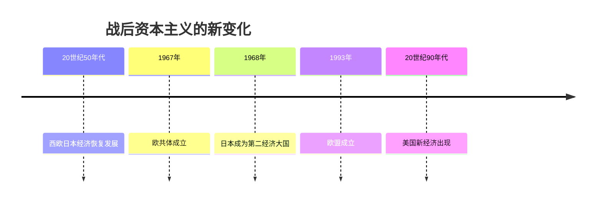
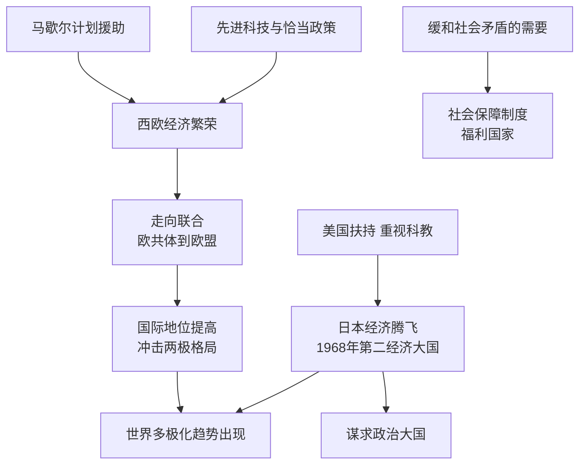

# 第17课 二战后资本主义的新变化

## 时间线

- 20 世纪 50-70 年代：西欧经济持续繁荣，联邦德国和日本经济高速发展
- 1967 年：欧洲共同体（欧共体）成立
- 1968 年：日本成为资本主义世界仅次于美国的第二经济大国
- 20 世纪 90 年代：美国出现以信息化和全球化为特征的"新经济"
- 1993 年：欧洲联盟（欧盟）成立

## 历史事件

欧洲的联合：二战后西欧凭借原有的工业基础、马歇尔计划的援助，采用最先进的科技成果、制定恰当的经济政策，实现了经济的持续繁荣。20 世纪 50 年代初法国和联邦德国等六国组建煤钢共同体，此后成立欧洲经济共同体和欧洲原子能共同体；1967 年三个组织合并为欧洲共同体。欧共体成员国加强经济合作，促进了西欧经济发展和国际地位提高。1993 年欧盟成立，标志欧洲一体化进入政治经济一体化的新阶段，大大加快了欧洲一体化的进程。

美国与日本：美国是战后资本主义世界头号经济强国，积极发展新兴产业，20 世纪 90 年代出现以信息化和全球化为特征的"新经济"。日本在美国的扶持下（冷战需要），制定适当的经济政策，大力引进先进技术，重视教育，经济高速增长，1968 年成为资本主义世界第二经济大国；随着经济崛起，日本谋求政治大国的欲望日益膨胀，军费开支不断增加。

社会保障制度：为缓和社会矛盾，罗斯福新政期间美国颁布《社会保障法》，二战后英国等西方国家宣布建成"福利国家"，社会保障制度日渐完善。社会保障制度可以缓和阶级矛盾、创造相对安定的社会环境，但不能解决资本主义制度的基本矛盾。

## 因果关系图

## 人物

- 本课以国家和组织为主角：欧共体与欧盟（联合自强的西欧）、美国（新经济）、日本（经济奇迹）

## 意义与影响

战后资本主义国家经历了新的发展：西欧走向联合，日本迅速崛起，美国保持领先并出现"新经济"，社会保障制度普遍建立。西欧和日本的崛起冲击了美国的经济霸主地位，推动世界朝多极化方向发展。这些变化是资本主义的自我调节，没有改变资本主义制度的本质。

## 概念对比

- 欧共体 vs 欧盟：1967 年经济合作组织 vs 1993 年政治经济一体化组织
- 西欧、日本崛起的共同原因：美国援助或扶持、重视科技教育、制定恰当政策
- 社会保障制度的两面性：缓和矛盾、稳定社会 vs 不能解决资本主义基本矛盾

## 背记要点

1. 西欧繁荣原因：工业基础 + 马歇尔计划 + 先进科技 + 恰当政策
2. 1967 年欧共体成立；1993 年欧盟成立
3. 1968 年日本成为资本主义世界第二经济大国
4. 美国 20 世纪 90 年代"新经济"：信息化、全球化
5. 西方国家建成"福利国家"，社会保障制度完善
6. 影响：冲击美国霸权，推动多极化趋势

## 相关链接

美国援助西欧的冷战考量见 [[第16课 冷战]]；国家干预经济的源头见 [[第13课 罗斯福新政]]；多极化趋势的进一步发展见 [[第21课 冷战后的世界格局]]。

## 自测题

1. 战后西欧经济繁荣的原因有哪些？
2. 欧共体和欧盟分别成立于哪一年？
3. 战后日本经济高速发展的原因是什么？
4. 美国"新经济"的特征是什么？
5. 如何评价西方国家的社会保障制度？
