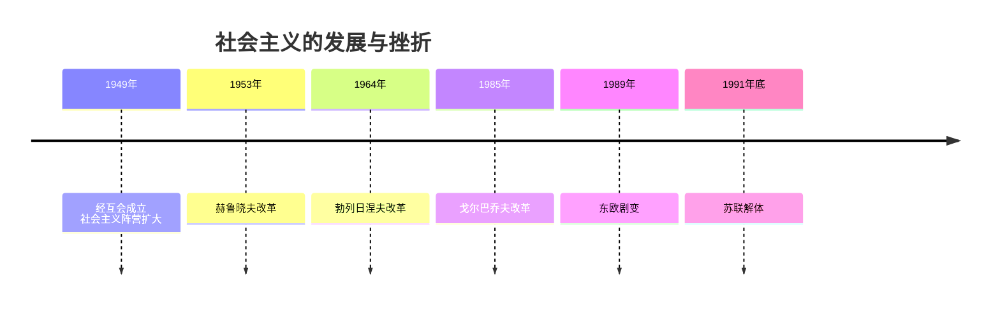
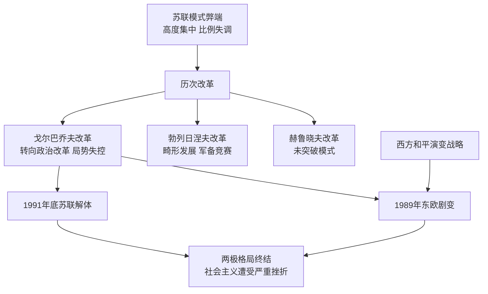

# 第18课 社会主义的发展与挫折

## 时间线

- 1949 年：苏联和东欧国家建立经济互助委员会（经互会）；中华人民共和国成立
- 1953 年：赫鲁晓夫上台，开始改革
- 1964 年：勃列日涅夫开始执政，改革重点发展重工业尤其是军事工业
- 1985 年：戈尔巴乔夫上台，先经济改革后转向政治改革
- 1989 年：东欧剧变，东欧各国社会制度发生根本性变化
- 1991 年底：苏联解体，两极格局终结

## 历史事件

社会主义力量的壮大：二战后东欧、亚洲、拉美出现一批社会主义国家。1949 年苏联同东欧国家建立经互会，将各成员国经济纳入苏联计划经济轨道；中苏 1950 年缔结友好同盟互助条约，加强了社会主义阵营的力量。苏联模式被推广到东欧各国。

苏联的改革：赫鲁晓夫改革（1953 年起）：批判斯大林个人崇拜，经济上发动垦荒运动、推广种植玉米、取消义务交售制、改革工业管理体制等，没有从根本上突破苏联模式（"没有改变高度集中的指令性计划经济体制"）。勃列日涅夫改革（1964 年起）：推行"新政策"，重点发展重工业特别是军事工业，同美国展开军备竞赛，国民经济畸形发展，仍未突破苏联模式。戈尔巴乔夫改革（1985 年起）：先实施加速经济改革方案，收效甚微后转向政治体制改革，取消苏共领导地位，实行多党制，倡导"公开性"和"政治多元化"，使人们思想混乱，无政府状态蔓延，局势失控。

东欧剧变与苏联解体：20 世纪 60 年代后东欧社会主义国家弊端暴露、改革失败、社会矛盾日益尖锐；受戈尔巴乔夫改革和西方"和平演变"战略影响，1989 年前后东欧各国社会制度发生根本性变化（实行议会民主制和多党制、私有化基础上的市场经济）。1991 年 8 月"八一九事件"后戈尔巴乔夫辞职，1991 年底苏联解体。

## 因果关系图

## 人物

- 赫鲁晓夫、勃列日涅夫：改革均未突破苏联模式
- 戈尔巴乔夫：改革失控，直接导致苏联解体

## 意义与影响

东欧剧变和苏联解体标志着两极格局的终结，社会主义运动遭受严重挫折，但这只是苏联模式的失败，不是社会主义制度本身的失败。启示：社会主义建设必须从本国国情出发，尊重客观经济规律，坚持改革与党的领导，不断改善民生（中国特色社会主义的成功印证了这一点）。

## 概念对比

- 三次改革对比：赫鲁晓夫（农业为主、小修小补）、勃列日涅夫（重工业军备、畸形发展）、戈尔巴乔夫（转向政治改革、导致解体）
- 东欧剧变实质：社会制度发生根本性变化
- 苏联解体 vs 沙俄灭亡：1991 年社会主义国家解体 vs 1917 年二月革命推翻帝制

## 背记要点

1. 1949 年经互会成立；苏联模式推广到东欧
2. 赫鲁晓夫、勃列日涅夫改革都没有从根本上突破苏联模式
3. 戈尔巴乔夫改革由经济转向政治，导致局势失控
4. 1989 年东欧剧变：社会制度发生根本性变化
5. 1991 年底苏联解体，两极格局终结
6. 根本原因：苏联模式的弊端长期得不到纠正

## 相关链接

苏联模式的形成见 [[第11课 苏联的社会主义建设]]；冷战对峙背景见 [[第16课 冷战]]；解体后的世界格局见 [[第21课 冷战后的世界格局]]。

## 自测题

1. 赫鲁晓夫改革为什么没有成功？
2. 勃列日涅夫改革的重点和后果是什么？
3. 戈尔巴乔夫改革与苏联解体有什么关系？
4. 东欧剧变的实质和原因是什么？
5. 苏联解体给我们哪些启示？
