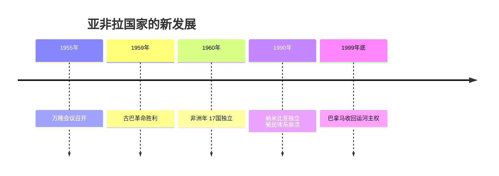
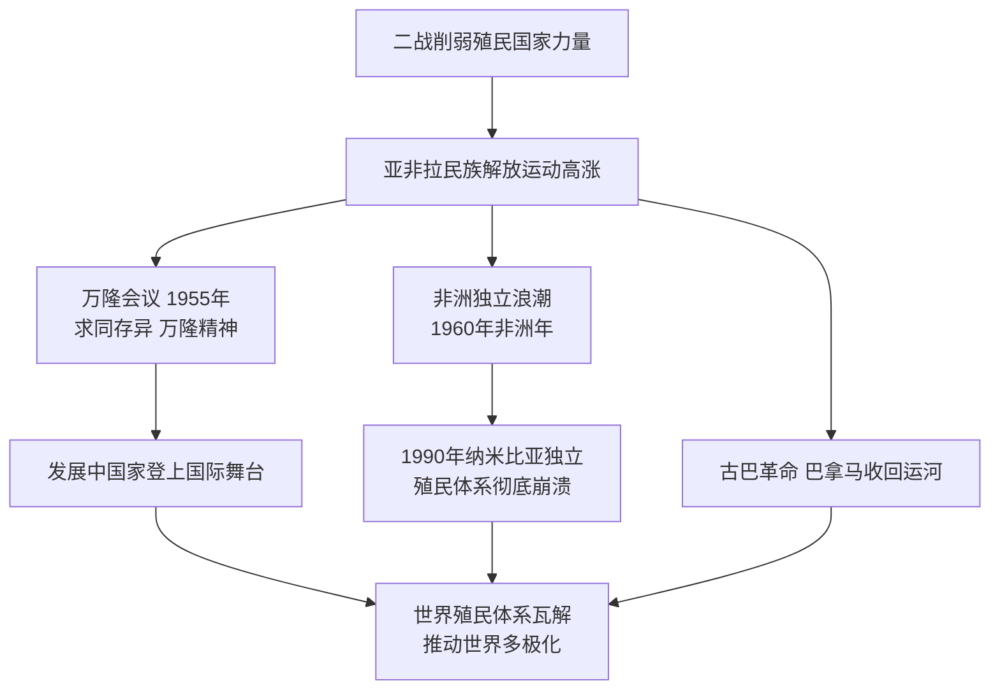

# 第19课 亚非拉国家的新发展

## 时间线

- 1955 年：万隆会议（亚非会议）召开，周恩来提出"求同存异"方针
- 1960 年：非洲有 17 个国家获得独立，这一年被称为"非洲年"
- 1959 年：古巴革命胜利，卡斯特罗建立革命政府
- 1990 年：纳米比亚独立，标志所有非洲国家摆脱殖民主义枷锁
- 1999 年底：巴拿马收回运河区的全部主权

## 历史事件

万隆会议：背景是二战后民族解放运动空前高涨，殖民帝国纷纷瓦解，亚非出现许多新独立国家。1955 年 4 月，29 个亚非国家和地区的代表在印度尼西亚万隆举行会议——这是第一次没有殖民主义国家参加的亚非会议。会议通过和平相处、友好合作的十项原则。中国代表周恩来提出"求同存异"方针，促进了会议的圆满成功。会议体现的亚非人民团结一致、保卫世界和平、增进各国人民间友谊的精神，被称为"万隆精神"。万隆会议提高了亚非国家和地区的民族自信，鼓舞了民族解放斗争，从此发展中国家作为一支新兴独立的政治力量登上国际舞台。

非洲独立运动：二战后非洲民族独立运动最先在北非展开——1951 年利比亚独立；1952 年埃及爆发革命，纳赛尔领导的"自由军官组织"发动武装起义，赢得埃及真正独立，1956 年埃及收回苏伊士运河主权。1960 年 17 个非洲国家独立，称为"非洲年"。1990 年纳米比亚独立，标志着所有非洲国家都摆脱了殖民主义的枷锁。

拉美人民维护国家主权的斗争：1959 年古巴革命胜利，卡斯特罗领导起义推翻美国支持的独裁政权，后来古巴走上社会主义道路。巴拿马人民长期为收回运河主权斗争，1999 年底收回运河区的全部主权。

## 因果关系图

## 人物

- 周恩来：万隆会议上提出"求同存异"方针
- 纳赛尔：领导埃及革命，收回苏伊士运河主权
- 卡斯特罗：领导古巴革命，推翻亲美独裁政权

## 意义与影响

二战后亚非拉民族解放运动使世界殖民体系逐渐土崩瓦解，一大批新兴独立国家诞生并作为新兴政治力量登上国际舞台，深刻改变了世界政治格局，有力推动了世界多极化趋势。万隆精神至今仍是发展中国家团结合作的旗帜。

## 概念对比

- 万隆会议特点：第一次没有殖民主义国家参加的亚非会议
- "非洲年"（1960，17 国独立）vs 殖民体系最终崩溃标志（1990 纳米比亚独立）
- 一战后运动（第12课）vs 二战后运动：前者高涨但多未独立；后者实现独立、殖民体系瓦解

## 背记要点

1. 1955 年万隆会议；周恩来"求同存异"；"万隆精神"
2. 非洲独立运动最先在北非展开；埃及纳赛尔收回苏伊士运河
3. 1960 年"非洲年"：17 个非洲国家独立
4. 1990 年纳米比亚独立——非洲殖民枷锁全部摆脱
5. 1959 年古巴革命（卡斯特罗）；1999 年底巴拿马收回运河主权

## 相关链接

一战后的先声见 [[第12课 亚非拉民族民主运动的高涨]]；殖民体系瓦解的战争背景见 [[第15课 第二次世界大战]]；发展中国家在当今格局中的地位见 [[第21课 冷战后的世界格局]]。

## 自测题

1. 万隆会议的特点和意义是什么？
2. "求同存异"方针是谁提出的？起了什么作用？
3. 为什么 1960 年被称为"非洲年"？
4. 非洲殖民体系彻底崩溃的标志是什么？
5. 古巴和巴拿马维护国家主权的斗争各取得什么成果？
