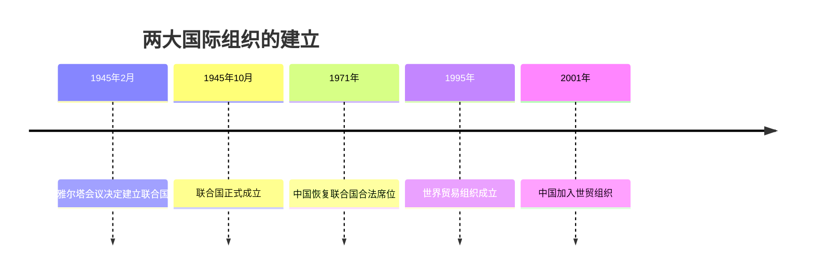
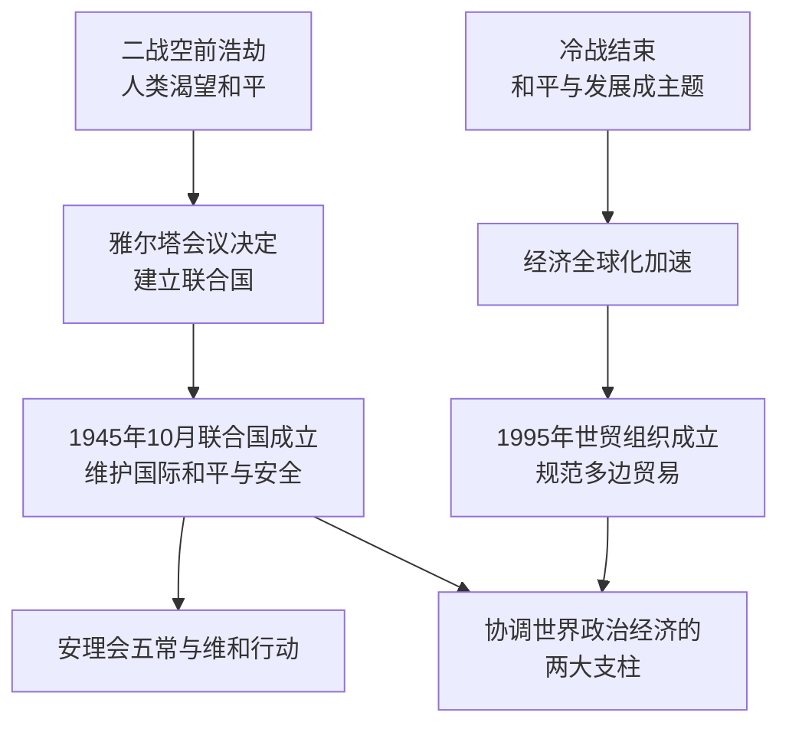

# 第20课 联合国与世界贸易组织

## 时间线

- 1945 年 2 月：雅尔塔会议决定战后成立联合国
- 1945 年 10 月：联合国正式成立，总部设在美国纽约
- 1971 年：中华人民共和国恢复在联合国的合法席位
- 1995 年 1 月 1 日：世界贸易组织（WTO）正式成立
- 2001 年：中国加入世界贸易组织

## 历史事件

联合国：背景是二战给人类带来空前灾难，世界人民渴望建立维护和平的国际机制；雅尔塔会议决定战后成立联合国。1945 年 10 月联合国正式成立，是人类构建世界和平的成果，也是影响最大的国际组织。宗旨：维护国际和平与安全。主要机构有联合国大会、联合国安全理事会（安理会）、联合国秘书处等。安理会是联合国中唯一有权采取行动维护国际和平与安全的机构，由中、法、俄、英、美 5 个常任理事国和 10 个非常任理事国组成，常任理事国拥有否决权。联合国还根据安理会或联大决议向冲突地区派出维和部队（"蓝盔部队"）。

经济全球化与世界贸易组织：20 世纪八九十年代以来，冷战结束、和平与发展成为时代主题，各国联系日益密切，世界经济全球化加速发展（表现：国际投资和国际贸易迅速增长、跨国公司影响增大、生产活动的全球化趋势加快）。1995 年 1 月 1 日世界贸易组织正式成立。宗旨：以非歧视性、开放、公平为原则开展国际贸易，促进世界经济发展，提高各国人民生活水平，保证充分就业。职能：制定和规范多边贸易协定、组织贸易谈判、解决贸易争端。世贸组织与联合国成为支撑、协调世界经济和政治的两大支柱。

## 因果关系图

## 人物

- 本课以国际组织为主角：联合国（政治安全支柱）与世界贸易组织（经济贸易支柱）；中国作为安理会常任理事国和世贸成员发挥重要作用

## 意义与影响

联合国在维护国际和平与安全、缓解冲突、促进合作方面发挥了积极作用，是全球集体安全机制的核心。世贸组织的成立促进了全球贸易和世界经济的发展。经济全球化使各国经济相互依存、相互竞争，对发展中国家既是机遇也是挑战。中国积极参与联合国事务并于 2001 年加入世贸组织，在全球治理中发挥着越来越重要的作用。

## 概念对比

- 联合国 vs 世贸组织：政治安全领域最大国际组织 vs 经济贸易领域最重要国际组织
- 安理会常任理事国：中、法、俄、英、美，拥有否决权
- 国际联盟 vs 联合国：一战后成立、软弱无力 vs 二战后成立、发挥实际作用

## 背记要点

1. 1945 年 10 月联合国成立；宗旨：维护国际和平与安全
2. 安理会五大常任理事国：中法俄英美，拥有否决权
3. 维和部队称"蓝盔部队"
4. 1995 年 1 月 1 日世贸组织成立；2001 年中国加入
5. 联合国与世贸组织是协调世界政治经济的两大支柱
6. 经济全球化表现：国际贸易投资增长、跨国公司发展、生产全球化

## 相关链接

联合国的筹建见 [[第15课 第二次世界大战]]；全球化的政治背景见 [[第21课 冷战后的世界格局]]；科技对全球化的推动见 [[第22课 不断发展的现代社会]]。

## 自测题

1. 联合国成立于何时？宗旨是什么？
2. 安理会常任理事国有哪些？拥有什么特殊权力？
3. 世贸组织何时成立？其职能是什么？
4. 经济全球化有哪些表现？
5. 为什么说联合国与世贸组织是世界的两大支柱？
