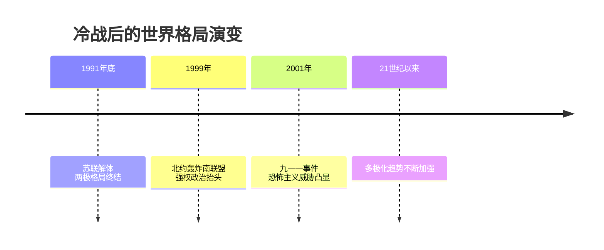
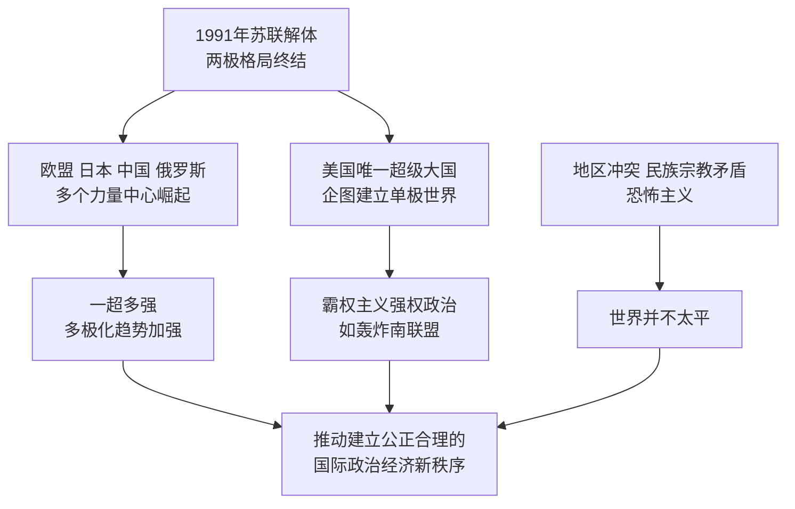

# 第21课 冷战后的世界格局

## 时间线

- 1991 年底：苏联解体，两极格局终结，世界格局向多极化方向发展
- 1999 年：以美国为首的北约越过联合国安理会，轰炸南联盟，中国驻南联盟大使馆被炸
- 2001 年：美国遭受九一一恐怖袭击，恐怖主义成为世界安全新威胁
- 21 世纪以来：欧盟、日本、中国、俄罗斯等多个力量中心发展壮大，多极化趋势不断加强

## 历史事件

霸权主义与地区冲突：冷战结束后天下并不太平，地区冲突、民族矛盾、宗教纷争不断，威胁世界安全；美国为首的西方国家推行霸权主义和强权政治，随意干涉他国内政甚至发动战争（如 1999 年北约轰炸南联盟，其间中国驻南联盟大使馆被炸，造成中方人员伤亡）。恐怖主义活动频繁（如 2001 年九一一事件），成为威胁世界安全的重要因素。霸权主义与强权政治是威胁世界和平与发展的主要根源之一。

世界多极化趋势的发展：苏联解体后美国成为唯一的超级大国，企图建立"单极世界"；但欧盟、日本、中国和俄罗斯等一些具备较强综合实力的国家或国家联盟也在推动世界朝多极化方向发展。广大发展中国家的总体实力增强，成为推动世界多极化的重要力量。新的世界格局尚未定型，一时间将呈现"一超多强"的局面，多极化趋势不可逆转。世界格局多极化的决定因素是各国综合国力（经济实力是基础）。

建立国际新秩序的努力：中国等广大发展中国家主张在国际关系中弘扬平等互信、包容互鉴、合作共赢的精神，共同维护国际公平正义；中国倡导构建人类命运共同体，推动"一带一路"国际合作，为世界和平与发展贡献中国方案。不结盟运动等也是建立国际新秩序的重要力量。

## 因果关系图

## 人物

- 本课以国际力量为主角：美国（唯一超级大国）、欧盟、日本、俄罗斯、中国及广大发展中国家共同塑造多极化格局

## 意义与影响

两极格局终结后，世界形势总体缓和，和平与发展成为时代主题，但霸权主义、地区冲突和恐怖主义使世界仍不安宁。多极化趋势的加强有利于抑制霸权主义、维护世界和平与稳定。中国坚持和平发展道路，倡导构建人类命运共同体，是维护世界和平、促进共同发展的重要力量。

## 概念对比

- 两极格局 vs "一超多强"：美苏对峙 vs 美国一超与多个力量中心并存
- 多极化"趋势"：新格局尚未最终形成，多极化是发展方向
- 威胁和平的因素：霸权主义强权政治、地区冲突、民族宗教矛盾、恐怖主义

## 背记要点

1. 1991 年苏联解体，两极格局终结
2. 当今格局特点："一超多强"，多极化趋势不断加强
3. 多极力量：美国、欧盟、日本、中国、俄罗斯及发展中国家
4. 威胁和平的主要因素：霸权主义、地区冲突、恐怖主义
5. 决定国际格局的根本因素：综合国力
6. 中国主张：构建人类命运共同体，建立国际新秩序

## 相关链接

两极格局的形成与瓦解见 [[第16课 冷战]] 和 [[第18课 社会主义的发展与挫折]]；多极力量的成长见 [[第17课 二战后资本主义的新变化]] 与 [[第19课 亚非拉国家的新发展]]；全球治理机制见 [[第20课 联合国与世界贸易组织]]。

## 自测题

1. 两极格局终结的标志是什么？
2. 当今世界格局呈现什么特点？
3. 推动世界多极化的力量有哪些？
4. 威胁当今世界和平与安全的因素有哪些？
5. 中国为建立国际新秩序提出了哪些主张？
