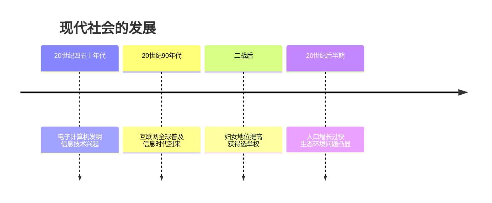
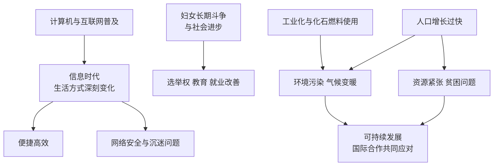

# 第22课 不断发展的现代社会

## 时间线

- 20 世纪四五十年代：第三次科技革命兴起，电子计算机的发明与普及
- 20 世纪 90 年代以来：互联网在全球迅速普及，人类进入"信息时代"
- 二战后：妇女地位显著提高，越来越多国家的妇女获得选举权
- 20 世纪后半期以来：世界人口增长过快、环境恶化等全球性问题日益突出

## 历史事件

计算机网络与现代社会生活：电子计算机的发明和互联网的普及将人类带入"信息时代"。计算机网络深刻改变着人们的思想观念、思维方式和生活方式：人们可以远程购物、居家办公、网上学习交流，检索和处理信息更加便捷。网络安全、网络沉迷等问题也随之出现，需要合理利用网络（一分为二看待网络的影响）。

妇女地位的提高：背景是工业革命后妇女走出家庭成为劳动者，为争取平等权利长期斗争。19 世纪末 20 世纪初一些国家的妇女开始获得选举权；二战后越来越多国家的妇女获得选举权，各国妇女的受教育程度普遍提高，就业情况明显改善。1979 年联合国大会通过《消除对妇女一切形式歧视公约》。但男女平等的目标尚未完全实现，妇女在就业、政治参与等方面仍面临不平等。

生态与人口问题：工业化的推进使生态环境恶化：化石燃料大量使用造成大气污染，温室气体过度排放导致全球气候变暖；环境污染、生态破坏成为全球性问题。人口增长过快带来资源、就业、贫困等一系列问题，也加剧了环境的恶化。可持续发展理念应运而生：既满足当代人的需求，又不损害后代人满足其需求的能力。应对全球性问题需要世界各国共同努力、加强国际合作。

## 因果关系图

## 人物

- 本课以社会议题为主角：信息社会中的网民、争取平等权利的妇女群体、面对生态与人口挑战的全人类

## 意义与影响

计算机网络技术推动了经济全球化和社会信息化，深刻改变了人类文明的面貌；妇女地位的提高是社会文明进步的重要标志；生态与人口问题警示人类必须走可持续发展道路。现代社会的发展表明：科技是双刃剑，全球性问题需要全球合作解决，人类是休戚与共的命运共同体。

## 概念对比

- 三次科技革命对比：蒸汽时代、电气时代、信息时代
- 网络的利与弊：便捷高效、资源共享 vs 网络安全、沉迷问题
- 可持续发展核心：当代发展不损害后代满足需求的能力

## 背记要点

1. 电子计算机的发明和互联网的普及使人类进入"信息时代"
2. 二战后越来越多国家的妇女获得选举权，地位显著提高
3. 生态问题：环境污染、全球气候变暖（化石燃料、温室气体）
4. 人口增长过快加剧资源与环境压力
5. 应对之道：可持续发展、国际合作、构建人类命运共同体

## 相关链接

信息技术的经济表现见 [[第17课 二战后资本主义的新变化]] 中的美国"新经济"；全球治理平台见 [[第20课 联合国与世界贸易组织]]；结合时事的探究方法见 [[第23课 活动课：时事溯源]]。

## 自测题

1. 人类进入"信息时代"的标志是什么？
2. 计算机网络给社会生活带来了哪些变化？
3. 二战后妇女地位提高表现在哪些方面？
4. 当今世界面临哪些全球性生态与人口问题？
5. 什么是可持续发展？为什么全球性问题需要国际合作？
