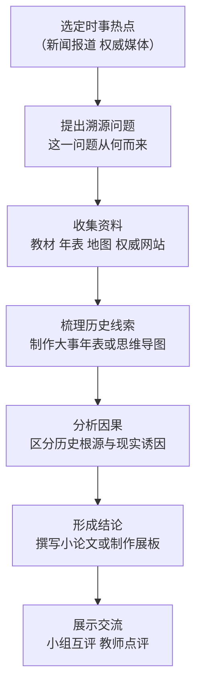

# 第23课 活动课：时事溯源

## 活动目标

1. 学会关注时事新闻，运用所学世界现代史知识追溯当今国际热点问题的历史根源
2. 掌握收集、整理、辨析史料与新闻信息的基本方法，区分事实与观点
3. 通过"从时事回溯历史"的探究，理解历史与现实的联系，培养史料实证与历史解释素养
4. 树立正确的国际视野与家国情怀，理解和平与发展是当今时代的主题

## 方法步骤

- 第一步：从近期新闻中选定一个国际热点，明确"是什么"
- 第二步：提出溯源问题，追问"为什么"，把问题分解成若干可查证的小问题
- 第三步：查阅教材相关课文和课外权威资料，注意资料出处与可信度
- 第四步：按时间顺序整理线索，用大事年表、时间轴或示意图呈现历史脉络
- 第五步：分析历史根源与现实因素的关系，形成自己有证据支撑的结论
- 第六步：以小论文、手抄报、演示文稿等形式展示，开展小组交流评议

## 选题示例

- 巴以冲突溯源：从一战后英国委任统治、二战后联合国分治决议到中东战争的历史线索
- 朝鲜半岛问题溯源：从日本殖民统治、二战结束、冷战对峙到朝鲜战争的分裂根源
- 欧洲一体化进程：从两次世界大战的教训到煤钢共同体、欧共体、欧盟的联合之路
- 俄乌关系的历史经纬：从苏联加盟共和国体制到 1991 年苏联解体后的地缘变化
- 联合国维和行动：从二战浩劫、雅尔塔会议到联合国集体安全机制的建立与运作
- 经济全球化与贸易摩擦：从世界市场形成、世贸组织成立看当今贸易规则之争

## 时事溯源示范（简例）

以"欧盟为何走向联合"为例：现实观察——欧盟是当今世界重要的力量中心；历史回溯——两次世界大战使欧洲深受战祸、地位衰落（第8课、第15课），战后借助马歇尔计划恢复经济（第16课），法德和解组建煤钢共同体，1967 年成立欧共体，1993 年成立欧盟（第17课）；结论——欧洲联合是对战争教训的反思和应对美苏格局、追求发展的必然选择。

## 概念对比

- 时事 vs 历史：时事是正在发生的历史；历史是理解时事的钥匙
- 事实 vs 观点：新闻报道中要区分客观事实与媒体立场
- 历史根源 vs 直接诱因：如冷战格局是许多地区问题的深层根源，具体事件只是导火索

## 背记要点

1. 溯源基本路径：选题——设问——查证——梳理——分析——结论——展示
2. 资料要注重权威性、多源互证
3. 分析国际问题要抓住"历史根源 + 现实因素"两条线
4. 结论必须有史实证据支撑，论从史出
5. 关注时事的落脚点：理解和平与发展的时代主题

## 相关链接

时事溯源常用的历史坐标：战后格局见 [[第16课 冷战]] 与 [[第21课 冷战后的世界格局]]；国际组织见 [[第20课 联合国与世界贸易组织]]；全球性问题见 [[第22课 不断发展的现代社会]]；发展中国家议题见 [[第19课 亚非拉国家的新发展]]。

## 自测题

1. 时事溯源探究包括哪些基本步骤？
2. 收集资料时如何判断资料的可信度？
3. 以一个你关注的国际热点为例，说明它的历史根源
4. 为什么说"时事是正在发生的历史"？
5. 通过时事溯源活动，你对和平与发展的时代主题有什么新认识？
