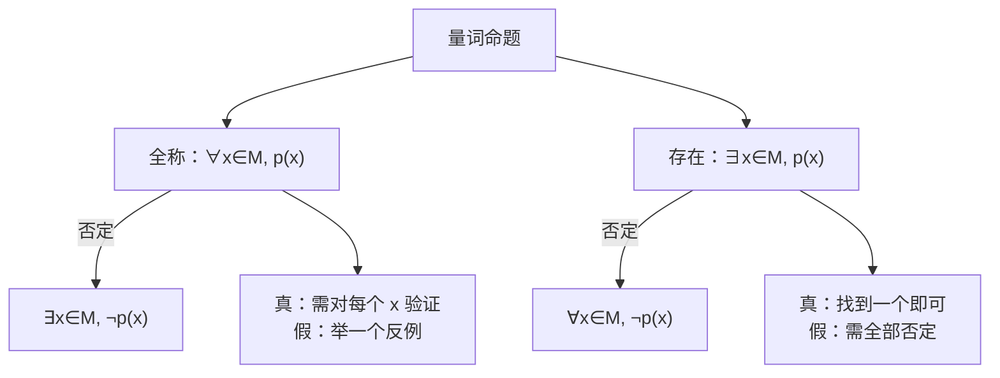

# 1.5 全称量词与存在量词

## 概念定义

**全称量词**："所有的""任意一个"，符号 $\forall$；含全称量词的命题叫**全称量词命题**：$\forall x\in M,\ p(x)$。

**存在量词**："存在一个""至少有一个"，符号 $\exists$；含存在量词的命题叫**存在量词命题**：$\exists x\in M,\ p(x)$。

**命题的否定**：否定量词并否定结论。

## 知识梳理

| 原命题 | 否定 | 真假关系 |
| --- | --- | --- |
| $\forall x\in M,\ p(x)$ | $\exists x\in M,\ \lnot p(x)$ | 一真一假 |
| $\exists x\in M,\ p(x)$ | $\forall x\in M,\ \lnot p(x)$ | 一真一假 |

**恒成立与能成立**（高考必考转化）：
- $\forall x\in M,\ a\ge f(x)$ 恒成立 $\Leftrightarrow a\ge f(x)_{\max}$；
- $\exists x\in M,\ a\ge f(x)$ 能成立 $\Leftrightarrow a\ge f(x)_{\min}$。

## 典型例题

**例 1**：写出命题"$\forall x\in\mathbb{R},\ x^2+2x+3>0$"的否定，并判断原命题真假。

**解**：否定为"$\exists x\in\mathbb{R},\ x^2+2x+3\le 0$"。
因 $x^2+2x+3=(x+1)^2+2\ge 2>0$ 恒成立，原命题为**真**，其否定为假。

**例 2**：若命题"$\exists x\in\mathbb{R},\ x^2+2x+m\le 0$"是假命题，求 $m$ 的范围。

**解**：该命题为假，则其否定"$\forall x\in\mathbb{R},\ x^2+2x+m>0$"为真，
即 $\Delta=4-4m<0$，解得 $m>1$。

## 易错点

- 否定命题时**量词与结论都要变**：只改结论不改量词是最常见错误。
- "$>$"的否定是"$\le$"而不是"$<$"；"都是"的否定是"不都是"而非"都不是"。
- 省略量词的命题（如"实数的平方非负"）默认是全称命题，先补全量词再否定。
- 恒成立取最大值、能成立取最小值，方向别搞反（针对 $a\ge f(x)$ 型）。

## 背记要点

1. 否定口诀：**改量词、否结论**，$\forall\leftrightarrow\exists$。
2. 全称命题为假只需一个反例；存在命题为真只需一个例证。
3. 恒成立 $\Leftrightarrow$ 与最值比较：$a\ge f_{\max}$（恒大于等于）。
4. 命题与其否定必然一真一假，可用"正难则反"求参数。

## 自测题

1. 命题"$\exists x\in\mathbb{R},\ x^2<0$"的否定是____。
2. 命题"所有的矩形都是平行四边形"的否定是____。
3. 若"$\forall x\in[1,2],\ x^2-a\le 0$"为真，则 $a$ 的范围是____。
4. 判断真假：$\exists x\in\mathbb{Z},\ x^2=3$。____

## 相关知识点

条件与命题的推出关系见 [[1.4 充分条件与必要条件]]；恒成立问题常结合 [[2.3 二次函数与一元二次方程、不等式]]。
