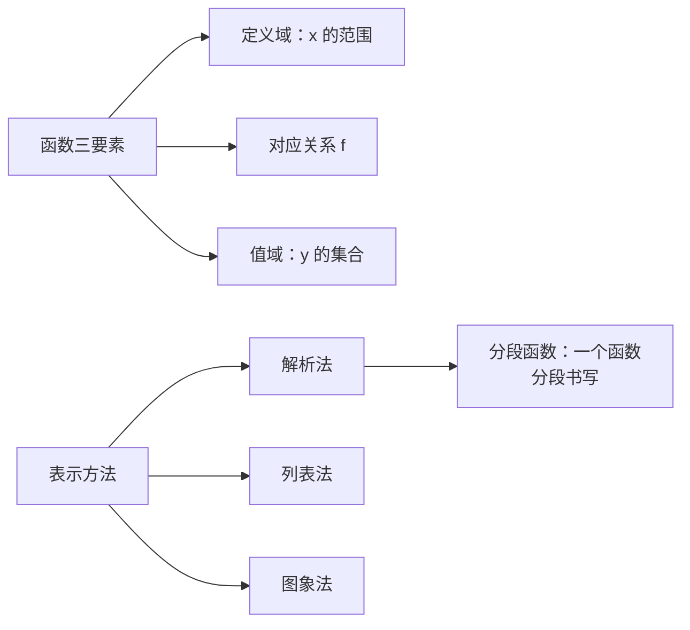

# 3.1 函数的概念及其表示

## 概念定义

设 $A,B$ 是非空实数集，若对 $A$ 中**任意一个** $x$，按对应关系 $f$，在 $B$ 中都有**唯一确定**的 $y$ 与之对应，则称 $f:A\to B$ 为从 $A$ 到 $B$ 的一个**函数**，记作 $y=f(x),\ x\in A$。

三要素：**定义域** $A$、**对应关系** $f$、**值域** $\{f(x)\mid x\in A\}\subseteq B$。

两函数相同 $\Leftrightarrow$ 定义域与对应关系都相同。

## 知识梳理

**求定义域的常见依据**：

| 结构 | 条件 |
| --- | --- |
| 分式 $\dfrac{1}{g(x)}$ | $g(x)\neq 0$ |
| 偶次根式 $\sqrt{g(x)}$ | $g(x)\ge 0$ |
| 零次幂 $[g(x)]^0$ | $g(x)\neq 0$ |
| 实际问题 | 符合实际意义 |

**抽象函数定义域**：$f(g(x))$ 中 $g(x)$ 的整体范围等于 $f(x)$ 中 $x$ 的范围。

## 典型例题

**例 1**：求函数 $f(x)=\dfrac{\sqrt{x+1}}{x-2}$ 的定义域。

**解**：需 $x+1\ge 0$ 且 $x-2\neq 0$，得 $x\ge -1$ 且 $x\neq 2$，
定义域为 $[-1,2)\cup(2,+\infty)$。

**例 2**：已知 $f(x)=\begin{cases}x+1, & x\le 0\\ x^2, & x>0\end{cases}$，求 $f(f(-2))$，并解方程 $f(x)=4$。

**解**：$f(-2)=-2+1=-1\le 0$，故 $f(f(-2))=f(-1)=0$。
解 $f(x)=4$：当 $x\le 0$ 时 $x+1=4$ 得 $x=3$（舍）；当 $x>0$ 时 $x^2=4$ 得 $x=2$。故 $x=2$。

## 易错点

- 判断函数：**一个 $x$ 只能对应一个 $y$**；竖直线与图象至多一个交点。
- $f(x)$ 与 $f(x+1)$ 定义域不同：若 $f(x)$ 定义域为 $[0,2]$，则 $f(x+1)$ 中需 $0\le x+1\le 2$，即 $x\in[-1,1]$。
- 分段函数求值先**判断自变量落在哪一段**；解方程要对每段分别求解并检验范围。
- 定义域必须写成集合或区间形式，不能只写不等式。

## 背记要点

1. 函数定义关键词：非空数集、任意、唯一。
2. 三要素中定义域优先：研究函数先求定义域。
3. 抽象函数定义域口诀：**括号内整体范围一致**。
4. 分段函数是一个函数，定义域是各段并集，值域是各段值域并集。

## 自测题

1. 函数 $f(x)=\sqrt{2-x}+\dfrac{1}{x}$ 的定义域为____。
2. 已知 $f(x)$ 定义域为 $[1,4]$，则 $f(2x)$ 的定义域为____。
3. 判断：$y=x$ 与 $y=\dfrac{x^2}{x}$ 是同一函数（对/错）____。
4. 设 $f(x)=\begin{cases}2x, & x\ge 1\\ x+1, & x<1\end{cases}$，则 $f(f(0))=$____。

## 相关知识点

函数的单调性与奇偶性见 [[3.2 函数的基本性质]]；特殊函数模型见 [[3.3 幂函数]] 与 [[4.2 指数函数]]。
