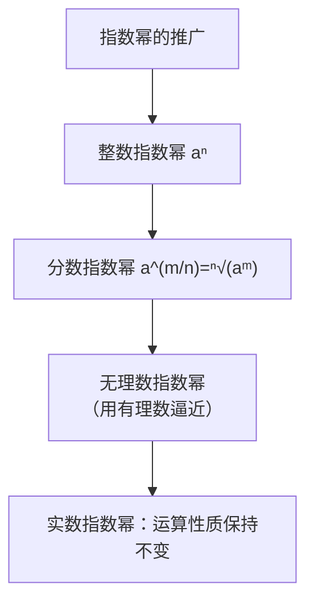

# 4.1 指数

## 概念定义

**$n$ 次方根**：若 $x^n=a$（$n>1,\ n\in\mathbb{N}^*$），则 $x$ 叫 $a$ 的 $n$ 次方根。
$n$ 为奇数时，$x=\sqrt[n]{a}$（唯一）；$n$ 为偶数且 $a>0$ 时，$x=\pm\sqrt[n]{a}$；负数没有偶次方根。

**分数指数幂**：$a^{\frac{m}{n}}=\sqrt[n]{a^m}$，$a^{-\frac{m}{n}}=\dfrac{1}{\sqrt[n]{a^m}}$（$a>0,\ m,n\in\mathbb{N}^*,\ n>1$）。

$0$ 的正分数指数幂为 $0$，$0$ 的负分数指数幂无意义。

## 知识梳理

**根式重要结论**：

| 式子 | 结果 | 条件 |
| --- | --- | --- |
| $(\sqrt[n]{a})^n$ | $a$ | 式子有意义时 |
| $\sqrt[n]{a^n}$（$n$ 奇） | $a$ | 任意 $a$ |
| $\sqrt[n]{a^n}$（$n$ 偶） | $\lvert a\rvert$ | 任意 $a$ |

**运算性质**（$a>0,\ b>0,\ r,s\in\mathbb{R}$）：
$$a^r a^s=a^{r+s},\qquad (a^r)^s=a^{rs},\qquad (ab)^r=a^r b^r.$$

## 典型例题

**例 1**：化简 $\left(2\dfrac14\right)^{\frac12}-(-9.6)^0-\left(3\dfrac38\right)^{-\frac23}+(1.5)^{-2}$。

**解**：原式 $=\left(\dfrac94\right)^{\frac12}-1-\left(\dfrac{27}{8}\right)^{-\frac23}+\left(\dfrac32\right)^{-2}$
$=\dfrac32-1-\left(\dfrac32\right)^{-2}+\left(\dfrac32\right)^{-2}=\dfrac12$。

**例 2**：已知 $a^{\frac12}+a^{-\frac12}=3$，求 $a+a^{-1}$ 与 $a^2+a^{-2}$。

**解**：平方得 $a+2+a^{-1}=9$，故 $a+a^{-1}=7$；
再平方：$a^2+2+a^{-2}=49$，故 $a^2+a^{-2}=47$。

## 易错点

- 偶次根式 $\sqrt{a^2}=|a|$，不能直接写 $a$；去绝对值要讨论符号。
- 分数指数幂中约定 **$a>0$**；$(-8)^{\frac13}$ 应先写为 $-\sqrt[3]{8}$ 处理，不能套分数幂性质。
- $a^0=1$ 要求 $a\neq 0$。
- 化简结果不能同时含根号与分数指数幂，形式要统一。

## 背记要点

1. $a^{\frac{m}{n}}=\sqrt[n]{a^m}$，负指数即倒数：$a^{-r}=\dfrac1{a^r}$。
2. 三条运算律：同底相乘指数加、乘方乘方指数乘、积的乘方各自乘方。
3. 偶次开方带绝对值：$\sqrt[2k]{a^{2k}}=|a|$。
4. "配平方"技巧：由 $a^{\frac12}+a^{-\frac12}$ 平方联系 $a+a^{-1}$。

## 自测题

1. $\sqrt[3]{(-2)^3}=$____，$\sqrt[4]{(-2)^4}=$____。
2. $16^{\frac34}=$____。
3. 化简：$\dfrac{a^2}{\sqrt{a}\cdot\sqrt[3]{a^2}}=a$ 的____次幂。
4. 已知 $x+x^{-1}=4$（$x>0$），则 $x^{\frac12}+x^{-\frac12}=$____。

## 相关知识点

以指数幂为基础的函数见 [[4.2 指数函数]]；指数的逆运算见 [[4.3 对数]]。
