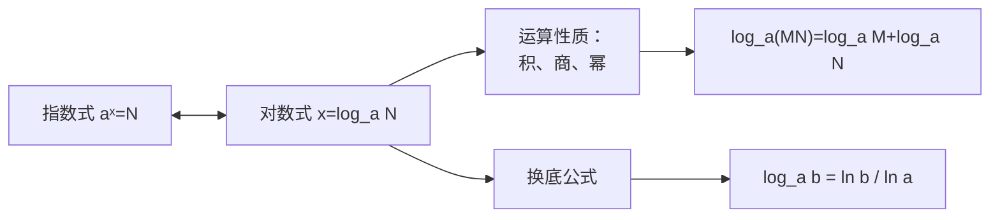

# 4.3 对数

## 概念定义

若 $a^x=N$（$a>0,\ a\neq 1$），则 $x$ 叫做以 $a$ 为底 $N$ 的**对数**，记作
$$x=\log_a N \quad (N>0).$$

**常用对数**：$\lg N=\log_{10}N$；**自然对数**：$\ln N=\log_e N$（$e\approx 2.718$）。

指对互化：$a^x=N\Longleftrightarrow x=\log_a N$。

## 知识梳理

**运算性质**（$a>0,a\neq1,\ M>0,N>0$）：

| 性质 | 公式 |
| --- | --- |
| 积 | $\log_a(MN)=\log_a M+\log_a N$ |
| 商 | $\log_a\dfrac{M}{N}=\log_a M-\log_a N$ |
| 幂 | $\log_a M^n=n\log_a M$ |
| 换底 | $\log_a b=\dfrac{\log_c b}{\log_c a}$ |

**重要恒等式**：$\log_a 1=0$，$\log_a a=1$，$a^{\log_a N}=N$，$\log_a b\cdot\log_b a=1$。

## 典型例题

**例 1**：计算 $\lg 25+\lg 4+\log_2 8-\log_3\dfrac13$。

**解**：$\lg 25+\lg 4=\lg 100=2$；$\log_2 8=3$；$\log_3\dfrac13=-1$。
原式 $=2+3-(-1)=6$。

**例 2**：已知 $\log_2 3=a$，$\log_2 5=b$，用 $a,b$ 表示 $\log_4 45$。

**解**：$\log_4 45=\dfrac{\log_2 45}{\log_2 4}=\dfrac{\log_2(3^2\times5)}{2}=\dfrac{2\log_2 3+\log_2 5}{2}=\dfrac{2a+b}{2}$。

## 易错点

- 对数有意义的条件：**底数 $a>0$ 且 $a\neq 1$，真数 $N>0$**，求定义域时勿漏。
- $\log_a(M+N)\neq\log_a M+\log_a N$：性质是"积化和"，没有"和的对数"公式。
- $(\log_a M)^n\neq\log_a M^n$，前者是对数的幂，后者可提指数。
- 换底后别忘化简，如 $\log_4 8=\dfrac{3\log_2 2}{2\log_2 2}=\dfrac32$。

## 背记要点

1. 定义即互化：$a^x=N\Leftrightarrow x=\log_a N$。
2. 三大运算性质：积加、商减、幂提前。
3. 换底公式 $\log_a b=\dfrac{\ln b}{\ln a}$；倒数关系 $\log_a b=\dfrac1{\log_b a}$。
4. 特殊值：$\log_a1=0$，$\log_a a=1$，$a^{\log_a N}=N$。

## 自测题

1. 将 $3^4=81$ 化为对数式：____。
2. $\log_5 25+\lg\dfrac1{100}=$____。
3. $2^{\log_2 7}=$____。
4. 若 $\lg 2=m$，则 $\lg 5=$____（用 $m$ 表示）。

## 相关知识点

指数运算见 [[4.1 指数]]；以对数为解析式的函数见 [[4.4 对数函数]]。
