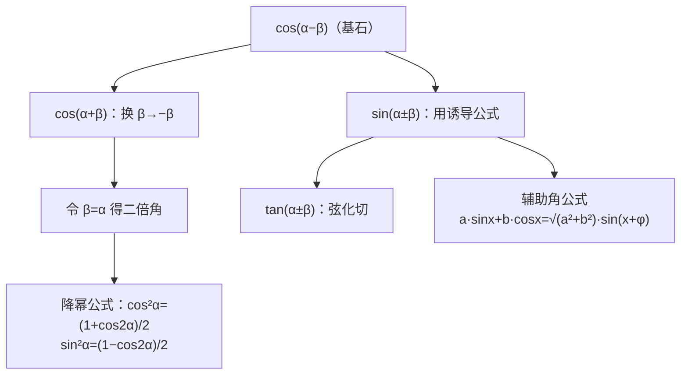

# 5.5 三角恒等变换

## 概念定义

**两角和与差公式**（核心是 $\cos(\alpha-\beta)$，由单位圆向量推出）：
$$\cos(\alpha\mp\beta)=\cos\alpha\cos\beta\pm\sin\alpha\sin\beta$$
$$\sin(\alpha\pm\beta)=\sin\alpha\cos\beta\pm\cos\alpha\sin\beta$$
$$\tan(\alpha\pm\beta)=\dfrac{\tan\alpha\pm\tan\beta}{1\mp\tan\alpha\tan\beta}$$

**二倍角公式**：$\sin2\alpha=2\sin\alpha\cos\alpha$；$\cos2\alpha=\cos^2\alpha-\sin^2\alpha=2\cos^2\alpha-1=1-2\sin^2\alpha$；$\tan2\alpha=\dfrac{2\tan\alpha}{1-\tan^2\alpha}$。

## 知识梳理

**辅助角公式**：$a\sin x+b\cos x=\sqrt{a^2+b^2}\,\sin(x+\varphi)$，其中 $\tan\varphi=\dfrac{b}{a}$。

常用变形：$1+\cos2\alpha=2\cos^2\alpha$，$1-\cos2\alpha=2\sin^2\alpha$（升降幂桥梁）。

## 典型例题

**例 1**：求 $\sin 75^\circ$ 的值。

**解**：$\sin75^\circ=\sin(45^\circ+30^\circ)=\sin45^\circ\cos30^\circ+\cos45^\circ\sin30^\circ$
$=\dfrac{\sqrt2}{2}\cdot\dfrac{\sqrt3}{2}+\dfrac{\sqrt2}{2}\cdot\dfrac12=\dfrac{\sqrt6+\sqrt2}{4}$。

**例 2**：化简 $f(x)=\sin^2x+\sqrt3\sin x\cos x$ 并求最大值。

**解**：降幂：$f(x)=\dfrac{1-\cos2x}{2}+\dfrac{\sqrt3}{2}\sin2x=\sin\left(2x-\dfrac\pi6\right)+\dfrac12$。
当 $2x-\dfrac\pi6=\dfrac\pi2+2k\pi$ 时，$f(x)_{\max}=\dfrac32$。

## 易错点

- 公式符号易混：$\cos(\alpha+\beta)$ 展开中间是**减号**，$\sin(\alpha+\beta)$ 中间是加号。
- 求值问题注意**角的范围**定符号：由 $\cos\alpha$ 求 $\sin\alpha$ 要看象限。
- 使用 $\tan$ 和角公式的前提是各角正切都存在，且分母 $1\mp\tan\alpha\tan\beta\neq0$。
- 化 $a\sin x+b\cos x$ 时 $\varphi$ 的象限由 $(a,b)$ 定，机械套 $\arctan\dfrac{b}{a}$ 会错。

## 背记要点

1. 记忆链：$\cos(\alpha-\beta)$ → 全套和差公式 → 二倍角 → 降幂。
2. $\cos2\alpha$ 三种形式按需选取：已知 $\sin$ 用 $1-2\sin^2\alpha$，已知 $\cos$ 用 $2\cos^2\alpha-1$。
3. 辅助角公式把"正余混合"化为单一正弦，是求周期最值的标准第一步。
4. 角的拆凑：$\alpha=(\alpha+\beta)-\beta$，$2\alpha=(\alpha+\beta)+(\alpha-\beta)$。

## 自测题

1. $\cos15^\circ=$____。
2. 已知 $\sin\alpha=\dfrac35$，$\alpha\in\left(\dfrac\pi2,\pi\right)$，则 $\sin2\alpha=$____。
3. $\tan15^\circ+\tan30^\circ+\tan15^\circ\tan30^\circ=$____。
4. 化简：$\sin x+\sqrt3\cos x=$____$\sin\left(x+\text{____}\right)$。

## 相关知识点

诱导公式是特例来源，见 [[5.3 诱导公式]]；化简结果的图象研究见 [[5.6 函数 y=Asin(ωx+φ)]]；性质分析见 [[5.4 三角函数的图象与性质]]。
