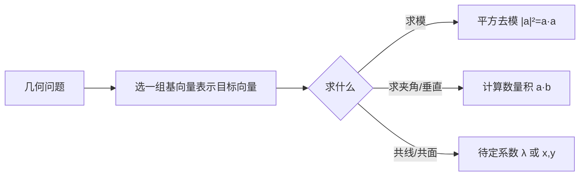

# 1.1 空间向量及其运算

## 概念定义

**空间向量**：空间中既有大小又有方向的量，用有向线段表示，记作 $\vec{a}$ 或 $\overrightarrow{AB}$，大小称为模，记 $|\vec{a}|$。
**共线（平行）向量**：方向相同或相反的非零向量；规定 $\vec{0}$ 与任意向量共线。
**共面向量**：平行于同一平面的向量。
**数量积**：$\vec{a}\cdot\vec{b}=|\vec{a}||\vec{b}|\cos\langle\vec{a},\vec{b}\rangle$，夹角 $\langle\vec{a},\vec{b}\rangle\in[0,\pi]$。

空间向量的加、减、数乘运算与平面向量完全一致（三角形法则、平行四边形法则），满足交换律、结合律与分配律。

## 知识梳理

| 项目 | 内容 | 备注 |
| --- | --- | --- |
| 加法 | $\overrightarrow{AB}+\overrightarrow{BC}=\overrightarrow{AC}$ | 首尾相接，空间中仍成立 |
| 减法 | $\overrightarrow{OA}-\overrightarrow{OB}=\overrightarrow{BA}$ | 箭头指向被减向量 |
| 数乘 | $\lambda\vec{a}$，模为 $|\lambda||\vec{a}|$ | $\lambda>0$ 同向，$\lambda<0$ 反向 |
| 共线定理 | $\vec{b}=\lambda\vec{a}$（$\vec{a}\ne\vec{0}$）$\Leftrightarrow\vec{a}\parallel\vec{b}$ | 证三点共线的工具 |
| 共面定理 | $\vec{p}=x\vec{a}+y\vec{b}$（$\vec{a},\vec{b}$ 不共线）$\Leftrightarrow$ 三向量共面 | 证四点共面 |
| 数量积 | $\vec{a}\cdot\vec{b}=|\vec{a}||\vec{b}|\cos\theta$ | 非零向量 $\vec{a}\perp\vec{b}\Leftrightarrow\vec{a}\cdot\vec{b}=0$ |
| 模与夹角 | $|\vec{a}|=\sqrt{\vec{a}\cdot\vec{a}}$，$\cos\theta=\dfrac{\vec{a}\cdot\vec{b}}{|\vec{a}||\vec{b}|}$ | 求模先平方 |

**四点共面常用结论**：若 $\overrightarrow{OP}=x\overrightarrow{OA}+y\overrightarrow{OB}+z\overrightarrow{OC}$ 且 $x+y+z=1$，则 $P,A,B,C$ 四点共面。

## 解题思路图

## 典型例题

**例 1**：棱长为 1 的正方体 $ABCD\text{-}A_1B_1C_1D_1$ 中，求 $\overrightarrow{AB}\cdot\overrightarrow{AC_1}$。

**解**：$\overrightarrow{AC_1}=\overrightarrow{AB}+\overrightarrow{AD}+\overrightarrow{AA_1}$。
由 $\overrightarrow{AB}\perp\overrightarrow{AD}$，$\overrightarrow{AB}\perp\overrightarrow{AA_1}$，得
$\overrightarrow{AB}\cdot\overrightarrow{AC_1}=|\overrightarrow{AB}|^2+0+0=1$。

**例 2**：空间四边形 $OABC$ 中，$\overrightarrow{OM}=\dfrac13\overrightarrow{OA}+\dfrac13\overrightarrow{OB}+\dfrac13\overrightarrow{OC}$，判断点 $M$ 与平面 $ABC$ 的位置关系。

**解**：系数和 $\dfrac13+\dfrac13+\dfrac13=1$，故 $M,A,B,C$ 四点共面，即 $M$ 在平面 $ABC$ 内。
验证：$\overrightarrow{AM}=\overrightarrow{OM}-\overrightarrow{OA}=\dfrac13(\overrightarrow{AB}+\overrightarrow{AC})$，由 $\overrightarrow{AB},\overrightarrow{AC}$ 线性表示，故共面（$M$ 恰为 $\triangle ABC$ 的重心）。

## 易错点

- 向量可自由平移，"共线向量"看方向，不要求在同一直线上。
- 共面向量定理要求基向量 $\vec{a},\vec{b}$ **不共线**，否则结论失效。
- 数量积是数量，$(\vec{a}\cdot\vec{b})\vec{c}\ne\vec{a}(\vec{b}\cdot\vec{c})$，无结合律，也不能"约去"向量。
- $x+y+z=1$ 判共面的前提：四个向量同起点 $O$。

## 背记要点

1. 空间向量线性运算与平面向量完全相同，"平面结论可搬到空间"。
2. 共线：$\vec{b}=\lambda\vec{a}$；共面：$\vec{p}=x\vec{a}+y\vec{b}$。
3. $\overrightarrow{OP}=x\overrightarrow{OA}+y\overrightarrow{OB}+z\overrightarrow{OC}$ 且 $x+y+z=1\Leftrightarrow P,A,B,C$ 共面。
4. 求模先平方：$|\vec{a}+\vec{b}+\vec{c}|^2$ 展开为各模平方与两两数量积 2 倍之和。
5. 高考视角：以正方体、四面体为背景，用基底表示向量后算数量积，是空间向量小题的基本套路。

## 自测题

1. 化简 $\overrightarrow{AB}+\overrightarrow{BC}+\overrightarrow{CD}+\overrightarrow{DA}=$____。
2. $|\vec{a}|=2$，$|\vec{b}|=1$，夹角 $120°$，则 $\vec{a}\cdot\vec{b}=$____。
3. 若 $\overrightarrow{OP}=\dfrac12\overrightarrow{OA}+t\overrightarrow{OB}+\dfrac14\overrightarrow{OC}$ 且 $P,A,B,C$ 共面，则 $t=$____。
4. 判断：空间中任意两个向量都是共面向量。（　）

## 相关知识点

基底与正交分解见 [[1.2 空间向量基本定理]]；坐标化运算见 [[1.3 空间向量及其运算的坐标表示]]；立体几何应用见 [[1.4 空间向量的应用]]。
