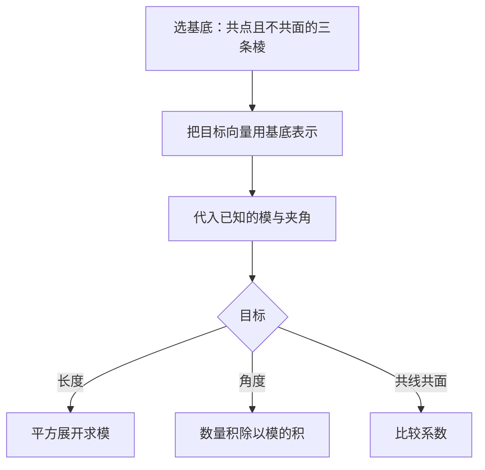

# 1.2 空间向量基本定理

## 概念定义

**空间向量基本定理**：若三个向量 $\vec{a},\vec{b},\vec{c}$ **不共面**，则对空间任一向量 $\vec{p}$，存在**唯一**的有序实数组 $(x,y,z)$，使
$$\vec{p}=x\vec{a}+y\vec{b}+z\vec{c}$$
其中 $\{\vec{a},\vec{b},\vec{c}\}$ 称为空间的一个**基底**，$\vec{a},\vec{b},\vec{c}$ 称为**基向量**。

**单位正交基底**：三个基向量两两垂直且模均为 1，常记 $\{\vec{i},\vec{j},\vec{k}\}$。
**正交分解**：把向量按单位正交基底分解，是建立空间直角坐标系的理论基础。

## 知识梳理

| 项目 | 内容 | 说明 |
| --- | --- | --- |
| 基底条件 | 三向量不共面 | 均为非零向量，且任一个不能由另两个表示 |
| 唯一性 | $(x,y,z)$ 唯一 | 同一基底下系数可"对应相等" |
| 判定不共面 | 设 $\vec{c}=x\vec{a}+y\vec{b}$ 无解 | 或用系数比较法导出矛盾 |
| 用基底求模 | $|\vec{p}|^2=\vec{p}\cdot\vec{p}$ 展开 | 需知基向量的模与两两夹角 |
| 用基底证垂直 | $\vec{p}\cdot\vec{q}=0$ | 全部化为基向量数量积 |
| 正交基底优势 | 交叉项数量积为 0 | 计算大幅简化，引出坐标法 |

**核心方法**：立体几何中常取共点三棱（如 $\overrightarrow{AB},\overrightarrow{AD},\overrightarrow{AA_1}$）作基底，将所有向量"翻译"为基向量组合。

## 解题思路图

## 典型例题

**例 1**：平行六面体 $ABCD\text{-}A_1B_1C_1D_1$ 中，设 $\overrightarrow{AB}=\vec{a}$，$\overrightarrow{AD}=\vec{b}$，$\overrightarrow{AA_1}=\vec{c}$，$M$ 为 $C_1D_1$ 的中点，用基底表示 $\overrightarrow{AM}$。

**解**：$\overrightarrow{AM}=\overrightarrow{AA_1}+\overrightarrow{A_1D_1}+\overrightarrow{D_1M}=\vec{c}+\vec{b}+\dfrac12\vec{a}$，
即 $\overrightarrow{AM}=\dfrac12\vec{a}+\vec{b}+\vec{c}$。

**例 2**：四面体 $OABC$ 中，$OA=OB=OC=1$，且两两夹角均为 $60°$，$M$ 为 $BC$ 中点，求 $|\overrightarrow{OM}|$。

**解**：$\overrightarrow{OM}=\dfrac12(\overrightarrow{OB}+\overrightarrow{OC})$。
$|\overrightarrow{OM}|^2=\dfrac14(|\overrightarrow{OB}|^2+2\overrightarrow{OB}\cdot\overrightarrow{OC}+|\overrightarrow{OC}|^2)=\dfrac14(1+2\times\dfrac12+1)=\dfrac34$，
故 $|\overrightarrow{OM}|=\dfrac{\sqrt3}{2}$。（其中 $\overrightarrow{OB}\cdot\overrightarrow{OC}=1\times1\times\cos60°=\dfrac12$。）

## 易错点

- 基底必须**不共面**：三个非零向量共面时不能作基底；含 $\vec{0}$ 的向量组一定不能作基底。
- "唯一性"是在**同一基底**下成立，换基底后系数会变。
- 用基底展开数量积时，交叉项 $\vec{a}\cdot\vec{b}$ 等**不为零**（除非正交基底），不要漏项。
- 平行六面体与正方体不同：棱不一定垂直，夹角信息需由题目给出。

## 背记要点

1. 定理内容：不共面的 $\{\vec{a},\vec{b},\vec{c}\}$ 可唯一线性表示空间任一向量。
2. 选基底口诀：**共起点、不共面、模与夹角已知**。
3. 中点公式：$M$ 为 $BC$ 中点 $\Rightarrow\overrightarrow{OM}=\dfrac12(\overrightarrow{OB}+\overrightarrow{OC})$。
4. 正交分解是坐标法的桥梁：单位正交基底下系数即坐标。
5. 高考视角：基底法多用于不易建系的斜棱柱、四面体问题，与坐标法互为补充。

## 自测题

1. 判断：任意三个非零空间向量都可以作基底。（　）
2. 平行六面体中 $\overrightarrow{AC_1}=$____（用 $\vec{a}=\overrightarrow{AB},\vec{b}=\overrightarrow{AD},\vec{c}=\overrightarrow{AA_1}$ 表示）。
3. 若 $\{\vec{a},\vec{b},\vec{c}\}$ 为基底且 $x\vec{a}+y\vec{b}+z\vec{c}=\vec{0}$，则 $x,y,z$ 满足____。
4. 四面体 $OABC$ 中 $G$ 为 $\triangle ABC$ 重心，则 $\overrightarrow{OG}=$____（用 $\overrightarrow{OA},\overrightarrow{OB},\overrightarrow{OC}$ 表示）。

## 相关知识点

向量线性运算与共面定理见 [[1.1 空间向量及其运算]]；正交基底下的坐标运算见 [[1.3 空间向量及其运算的坐标表示]]；基底法证明平行垂直见 [[1.4 空间向量的应用]]。
