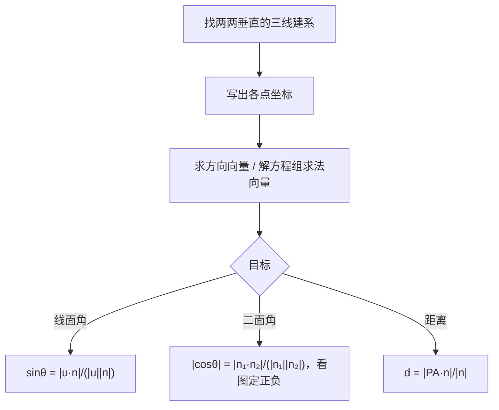

# 1.4 空间向量的应用

## 概念定义

**直线的方向向量**：与直线平行的非零向量 $\vec{u}$。
**平面的法向量**：与平面垂直的非零向量 $\vec{n}$；求法：设 $\vec{n}=(x,y,z)$，与平面内两个不共线向量的数量积均为 0，解方程组（可取一个分量为 1）。
用方向向量与法向量可将平行、垂直、角度、距离等立体几何问题**全部代数化**。

## 知识梳理

设直线 $l,m$ 的方向向量为 $\vec{u},\vec{v}$，平面 $\alpha,\beta$ 的法向量为 $\vec{n_1},\vec{n_2}$：

| 问题 | 向量公式 | 说明 |
| --- | --- | --- |
| 线线角 $\theta$ | $\cos\theta=\dfrac{|\vec{u}\cdot\vec{v}|}{|\vec{u}||\vec{v}|}$ | $\theta\in(0,\frac{\pi}{2}]$，加绝对值 |
| 线面角 $\theta$ | $\sin\theta=\dfrac{|\vec{u}\cdot\vec{n}|}{|\vec{u}||\vec{n}|}$ | 是 **sin** 不是 cos |
| 二面角 $\theta$ | $|\cos\theta|=\dfrac{|\vec{n_1}\cdot\vec{n_2}|}{|\vec{n_1}||\vec{n_2}|}$ | 结合图形判断锐角或钝角 |
| 线线平行 | $\vec{u}=\lambda\vec{v}$ | 还需说明不重合 |
| 线面垂直 | $\vec{u}=\lambda\vec{n}$ | 方向向量与法向量平行 |
| 面面平行 | $\vec{n_1}=\lambda\vec{n_2}$ | — |
| 点面距离 | $d=\dfrac{|\overrightarrow{PA}\cdot\vec{n}|}{|\vec{n}|}$ | $A$ 为面内任一点，$P$ 为面外点 |

## 解题流程图

## 典型例题

**例 1**：棱长为 2 的正方体 $ABCD\text{-}A_1B_1C_1D_1$ 中，求直线 $BC_1$ 与平面 $ABCD$ 所成角。

**解**：以 $D$ 为原点，$DA,DC,DD_1$ 为 $x,y,z$ 轴建系。$B(2,2,0)$，$C_1(0,2,2)$，
$\overrightarrow{BC_1}=(-2,0,2)$；平面 $ABCD$ 的法向量 $\vec{n}=(0,0,1)$。
$\sin\theta=\dfrac{|\overrightarrow{BC_1}\cdot\vec{n}|}{|\overrightarrow{BC_1}||\vec{n}|}=\dfrac{2}{2\sqrt2}=\dfrac{\sqrt2}{2}$，故 $\theta=45°$。

**例 2**：在例 1 的正方体中，求二面角 $A_1\text{-}BD\text{-}A$ 的正切值。

**解**：$A(2,0,0)$，$B(2,2,0)$，$A_1(2,0,2)$。平面 $ABD$（底面）法向量 $\vec{n_1}=(0,0,1)$。
平面 $A_1BD$：$\overrightarrow{DB}=(2,2,0)$，$\overrightarrow{DA_1}=(2,0,2)$，设 $\vec{n_2}=(x,y,z)$，
由 $2x+2y=0$，$2x+2z=0$ 取 $\vec{n_2}=(1,-1,-1)$。
$|\cos\theta|=\dfrac{|-1|}{1\times\sqrt3}=\dfrac{\sqrt3}{3}$，由图二面角为锐角，$\cos\theta=\dfrac{\sqrt3}{3}$，$\tan\theta=\sqrt2$。

## 易错点

- 线面角公式用 **$\sin\theta$**，因方向向量与法向向量夹角和线面角互余，最易记错。
- 二面角不能只看法向量夹角的余弦符号，须**结合图形**判断取 $\theta$ 还是 $\pi-\theta$。
- 法向量解方程组有无穷多解，取值后要**回代检验**两个方程都满足。
- 证明线面平行除 $\vec{u}\cdot\vec{n}=0$ 外，还须说明**直线不在平面内**。

## 背记要点

1. 三大角公式：线线用 $\cos$ 加绝对值；线面用 $\sin$；二面角用法向量 $\cos$ 再定号。
2. 点面距 $d=\dfrac{|\overrightarrow{PA}\cdot\vec{n}|}{|\vec{n}|}$，线面距、面面距均可转化为点面距。
3. 求法向量：两方程、设一元、取整解、回代验。
4. 建系优先找"墙角"模型（三线两两垂直共点）。
5. 高考视角：北京卷立体几何大题第 (2)(3) 问几乎必考线面角或二面角，坐标法书写要含建系依据、坐标、法向量过程、结论四要素。

## 自测题

1. 直线方向向量 $\vec{u}=(1,0,1)$，平面法向量 $\vec{n}=(0,1,1)$，则线面角的正弦值为____。
2. 两平面法向量分别为 $(1,1,0)$ 与 $(1,-1,0)$，则两平面位置关系是____。
3. 点 $P(1,1,1)$ 到平面 $z=0$ 的距离为____。
4. 判断：若直线方向向量与平面法向量垂直，则直线一定平行于该平面。（　）

## 相关知识点

坐标运算基础见 [[1.3 空间向量及其运算的坐标表示]]；基底法处理不便建系的问题见 [[1.2 空间向量基本定理]]；向量运算规则见 [[1.1 空间向量及其运算]]。
