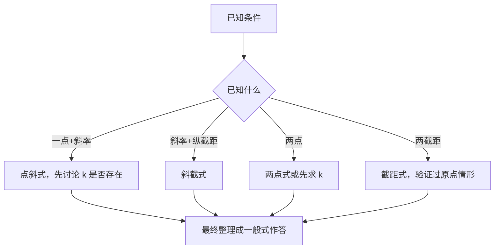

# 2.2 直线的方程

## 概念定义

直线方程是"点与斜率（或两点）确定直线"这一几何事实的代数化。共有**五种形式**，核心是点斜式，最通用的是一般式：
$$Ax+By+C=0\quad(A,B\text{ 不同时为 }0)$$
截距是坐标（可正可负可为零），**不是距离**。

## 知识梳理

| 形式 | 方程 | 适用条件 / 局限 |
| --- | --- | --- |
| 点斜式 | $y-y_0=k(x-x_0)$ | 不能表示斜率不存在的直线 |
| 斜截式 | $y=kx+b$ | 同上；$b$ 为纵截距 |
| 两点式 | $\dfrac{y-y_1}{y_2-y_1}=\dfrac{x-x_1}{x_2-x_1}$ | 不能表示水平线与竖直线 |
| 截距式 | $\dfrac{x}{a}+\dfrac{y}{b}=1$ | 不能表示过原点及与轴平行的直线 |
| 一般式 | $Ax+By+C=0$ | 可表示**一切**直线 |

**一般式中的斜率**：$B\ne0$ 时 $k=-\dfrac{A}{B}$，纵截距 $-\dfrac{C}{B}$；$B=0$ 时为竖直线 $x=-\dfrac{C}{A}$。

**平行与垂直（一般式）**：$l_1:A_1x+B_1y+C_1=0$，$l_2:A_2x+B_2y+C_2=0$，
平行 $\Leftrightarrow A_1B_2=A_2B_1$ 且不重合；垂直 $\Leftrightarrow A_1A_2+B_1B_2=0$。

## 选式策略

## 典型例题

**例 1**：求过点 $P(2,3)$ 且在两坐标轴上截距相等的直线方程。

**解**：分两类。
① 截距为 0：直线过原点，$k=\dfrac32$，方程 $y=\dfrac32x$，即 $3x-2y=0$。
② 截距 $a\ne0$：设 $\dfrac{x}{a}+\dfrac{y}{a}=1$，代入 $P$ 得 $a=5$，方程 $x+y-5=0$。
综上：$3x-2y=0$ 或 $x+y-5=0$。

**例 2**：求过点 $A(1,2)$ 且与直线 $2x+y-10=0$ 垂直的直线方程。

**解**：已知直线斜率 $k_1=-2$，所求直线斜率 $k=\dfrac12$。
点斜式：$y-2=\dfrac12(x-1)$，整理得 $x-2y+3=0$。
（也可设 $x-2y+c=0$ 代点求 $c$：垂直系"换系数、变号"技巧。）

## 易错点

- 用点斜式、斜截式前必须**讨论斜率是否存在**，漏掉竖直线是最常见失分点。
- "截距相等"要分**截距为 0**（过原点）与不为 0 两类，截距式不含过原点的直线。
- 截距可以为负，与"距离"不同；"截距的绝对值相等"包含 $k=\pm1$ 与过原点三类。
- 由 $\dfrac{A_1}{A_2}=\dfrac{B_1}{B_2}$ 判平行时，须排除**重合**且注意分母为 0 的情形。

## 背记要点

1. 五种形式及局限：点斜、斜截缺竖直线；两点缺水平竖直；截距缺过原点；一般式全能。
2. 一般式 $k=-\dfrac{A}{B}$（$B\ne0$）。
3. 平行系：$Ax+By+m=0$；垂直系：$Bx-Ay+m=0$（换系数变号）。
4. 答案统一化为一般式，系数化整且首项为正。
5. 高考视角：求直线方程重在分类讨论（斜率存在性、截距为零），是解析几何大题的基本功。

## 自测题

1. 过点 $(1,-1)$ 且斜率为 2 的直线的一般式方程为____。
2. 直线 $3x-4y+12=0$ 的横截距为____，纵截距为____。
3. 与 $x-2y+1=0$ 平行且过 $(2,1)$ 的直线方程为____。
4. 判断：任何直线都可以用斜截式表示。（　）

## 相关知识点

斜率与倾斜角基础见 [[2.1 直线的倾斜角与斜率]]；两直线交点与距离见 [[2.3 直线的交点坐标与距离公式]]；直线与圆位置关系见 [[2.5 直线与圆、圆与圆的位置关系]]。
