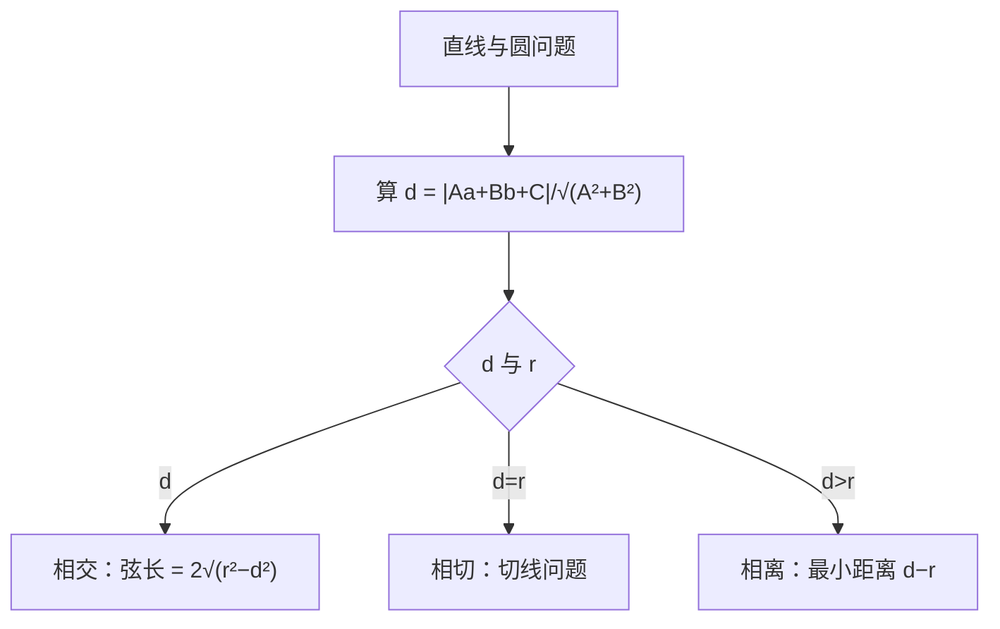

# 2.5 直线与圆、圆与圆的位置关系

## 概念定义

**直线与圆**有相交、相切、相离三种位置关系。判断首选**几何法**：比较圆心到直线的距离 $d$ 与半径 $r$。
**圆与圆**有外离、外切、相交、内切、内含五种位置关系，由圆心距 $d$ 与两半径 $r_1,r_2$ 比较确定。
**弦长公式**（垂径定理）：
$$|AB|=2\sqrt{r^2-d^2}$$

## 知识梳理

| 关系 | 几何条件 | 代数条件（联立后判别式） |
| --- | --- | --- |
| 直线与圆相交 | $d<r$ | $\Delta>0$ |
| 直线与圆相切 | $d=r$ | $\Delta=0$ |
| 直线与圆相离 | $d>r$ | $\Delta<0$ |
| 两圆外离 | $d>r_1+r_2$ | 4 条公切线 |
| 两圆外切 | $d=r_1+r_2$ | 3 条公切线 |
| 两圆相交 | $|r_1-r_2|<d<r_1+r_2$ | 2 条公切线 |
| 两圆内切 | $d=|r_1-r_2|$ | 1 条公切线 |
| 两圆内含 | $d<|r_1-r_2|$ | 0 条公切线 |

**切线结论**：圆 $x^2+y^2=r^2$ 上一点 $(x_0,y_0)$ 处切线为 $x_0x+y_0y=r^2$；过圆外一点的切线**恒有两条**（一条斜率可能不存在）。
**公共弦**：两相交圆方程相减即得公共弦所在直线方程。

## 判定流程图

## 典型例题

**例 1**：求直线 $l:x-y+1=0$ 被圆 $C:x^2+y^2-4x-2y+1=0$ 截得的弦长。

**解**：配方得 $(x-2)^2+(y-1)^2=4$，圆心 $(2,1)$，$r=2$。
$d=\dfrac{|2-1+1|}{\sqrt2}=\sqrt2$。
弦长 $|AB|=2\sqrt{r^2-d^2}=2\sqrt{4-2}=2\sqrt2$。

**例 2**：过点 $P(2,4)$ 作圆 $x^2+y^2=4$ 的切线，求切线方程。

**解**：① 斜率不存在：$x=2$，圆心到其距离为 $2=r$，是切线。
② 斜率存在：设 $y-4=k(x-2)$，即 $kx-y+4-2k=0$。
由 $\dfrac{|4-2k|}{\sqrt{k^2+1}}=2$ 得 $4k^2-16k+16=4k^2+4$，$k=\dfrac34$，
切线 $3x-4y+10=0$。综上：$x=2$ 或 $3x-4y+10=0$。

## 易错点

- 过圆外一点的切线**必有两条**，设点斜式只解出一条时，必漏了"斜率不存在"的竖直切线。
- 判断位置关系优先几何法（算 $d$ 比 $r$），代数法判别式计算量大且易错。
- 两圆方程相减得到的直线，只有在**两圆相交**时才是公共弦所在直线。
- 弦长公式中 $d$ 是**圆心到直线**的距离，不是圆心到弦端点的距离。

## 背记要点

1. 几何法三比较：$d<r$ 交、$d=r$ 切、$d>r$ 离。
2. 弦长 $=2\sqrt{r^2-d^2}$；半弦、弦心距、半径构成直角三角形。
3. 两圆位置关系五种，公切线条数 4、3、2、1、0 对应记忆。
4. 圆上点 $(x_0,y_0)$ 处切线：$x_0x+y_0y=r^2$。
5. 高考视角：直线与圆是北京卷高频考点，弦长、切线、与圆有关的最值常与向量、面积结合，几何法优先能大幅减少计算。

## 自测题

1. 直线 $y=x+b$ 与圆 $x^2+y^2=2$ 相切，则 $b=$____。
2. 圆 $x^2+y^2=1$ 与圆 $(x-3)^2+y^2=4$ 的位置关系是____。
3. 直线 $x=1$ 被圆 $(x-2)^2+y^2=4$ 截得的弦长为____。
4. 判断：两圆方程相减所得直线一定是公共弦所在直线。（　）

## 相关知识点

点到直线距离公式见 [[2.3 直线的交点坐标与距离公式]]；圆的方程与配方见 [[2.4 圆的方程]]；直线与圆锥曲线相交的弦长问题见 [[3.1 椭圆]]。
