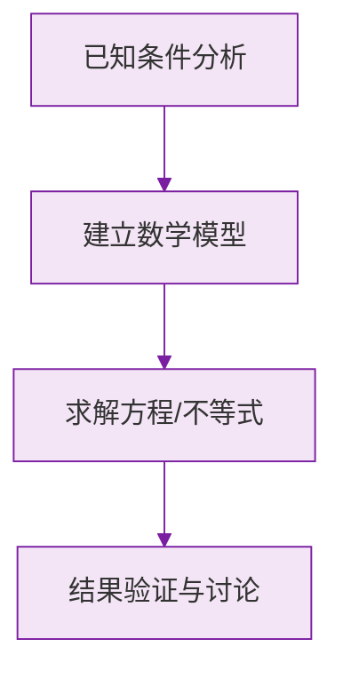

# 例题 · 正数和负数

## 例题 1（基础 · 概念辨析）

### 题目

下列各数中，是负数的是（　　）

A. $0$　　B. $-(-2)$　　C. $-\frac{1}{3}$　　D. $+5$

### 解析

- A：$0$ 既不是正数也不是负数；
- B：$-(-2) = 2$，是正数（负号套负号要化简后再判断）；
- C：$-\frac{1}{3}$ 小于 $0$，是负数 ✔；
- D：$+5 = 5$，是正数。

**答案：C**

> ⚠️ 判断正负前，一定先把 $-(-2)$ 这类数**化简**。

---

## 例题 2（基础 · 相反意义的量）

### 题目

如果收入 200 元记作 $+200$ 元，那么 $-150$ 元表示什么？收入 0 元又表示什么？

### 解析

规定收入为正，则负数表示相反意义——支出。

- $-150$ 元表示**支出 150 元**；
- $0$ 元表示**既没有收入也没有支出**（收支平衡）。

> 💡 翻译负数时，把"负号"换成"相反的动作"，数字保持正的说法。

---

## 例题 3（中档 · 基准量问题）

### 题目

某工厂计划每天生产零件 100 个，实际生产记录如下：星期一 $+8$，星期二 $-5$，星期三 $+2$（单位：个，超过计划记为正）。

(1) 星期二实际生产多少个零件？
(2) 这三天平均每天实际生产多少个？

### 解析

(1) $-5$ 表示比计划**少 5 个**：

$$
100 + (-5) = 95 \text{（个）}
$$

(2) 三天的记录之和为 $(+8) + (-5) + (+2) = +5$，即三天共比计划多 5 个：

$$
\frac{100 \times 3 + 5}{3} = \frac{305}{3} \approx 101.7 \text{（个）}
$$

若题目要求整数表述，可答"平均每天比计划多 $\frac{5}{3}$ 个，即约 101.7 个"。

**答案：(1) 95 个；(2) 约 101.7 个**

> 💡 "以计划量为基准记正负"是正负数最常考的应用，先算记录之和，再加回基准。

### 数学几何与函数分析

<svg xmlns="http://www.w3.org/2000/svg" viewBox="0 0 300 200" style="background-color: #f3e5f5; border: 1px solid #7b1fa2; border-radius: 8px;">
  <line x1="20" y1="180" x2="280" y2="180" stroke="#7b1fa2" stroke-width="2" />
  <line x1="50" y1="20" x2="50" y2="180" stroke="#7b1fa2" stroke-width="2" />
  <path d="M50,180 Q150,20 280,180" fill="none" stroke="#9c27b0" stroke-width="3" />
  <text x="260" y="195" fill="#7b1fa2" font-size="12">X轴</text>
  <text x="10" y="30" fill="#7b1fa2" font-size="12">Y轴</text>
  <text x="140" y="100" fill="#7b1fa2" font-size="14">抛物线图示</text>
</svg>

