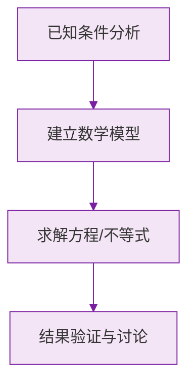

# 公式与定义卡片 · 正数和负数

## 1. 正数与负数

$$
\text{正数} > 0, \qquad \text{负数} < 0
$$

在正数 $a$ 前加负号得到负数 $-a$。

## 2. 0 的地位

$$
0 \text{ 既不是正数，也不是负数}
$$

正数、0、负数共同构成初一认识的数的全貌（有理数范围内）。

## 3. 相反意义的量

若规定一方为 "$+$"，则相反的一方为 "$-$"：

$$
\text{上升 } h \;\longleftrightarrow\; +h, \qquad \text{下降 } h \;\longleftrightarrow\; -h
$$

## 4. 非负数与非正数

- **非负数**：正数和 $0$，即 $a \ge 0$；
- **非正数**：负数和 $0$，即 $a \le 0$。

### 数学几何与函数分析

<svg xmlns="http://www.w3.org/2000/svg" viewBox="0 0 300 200" style="background-color: #f3e5f5; border: 1px solid #7b1fa2; border-radius: 8px;">
  <line x1="20" y1="180" x2="280" y2="180" stroke="#7b1fa2" stroke-width="2" />
  <line x1="50" y1="20" x2="50" y2="180" stroke="#7b1fa2" stroke-width="2" />
  <path d="M50,180 Q150,20 280,180" fill="none" stroke="#9c27b0" stroke-width="3" />
  <text x="260" y="195" fill="#7b1fa2" font-size="12">X轴</text>
  <text x="10" y="30" fill="#7b1fa2" font-size="12">Y轴</text>
  <text x="140" y="100" fill="#7b1fa2" font-size="14">抛物线图示</text>
</svg>

