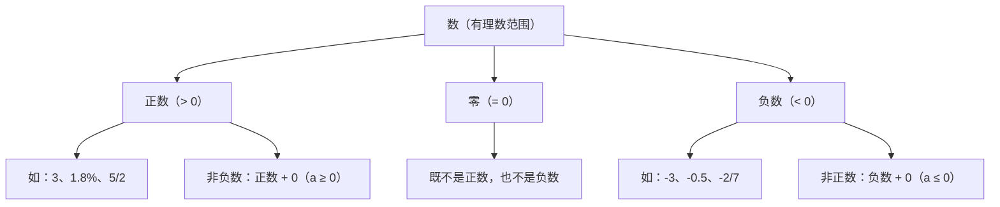

# 公式与定义卡片 · 正数和负数

## 知识结构

## 1. 正数与负数

$$
\text{正数} > 0, \qquad \text{负数} < 0
$$

在正数 $a$ 前加负号得到负数 $-a$。

## 2. 0 的地位

$$
0 \text{ 既不是正数，也不是负数}
$$

正数、0、负数共同构成初一认识的数的全貌（有理数范围内）。

## 3. 相反意义的量

若规定一方为 "$+$"，则相反的一方为 "$-$"：

$$
\text{上升 } h \;\longleftrightarrow\; +h, \qquad \text{下降 } h \;\longleftrightarrow\; -h
$$

## 4. 非负数与非正数

- **非负数**：正数和 $0$，即 $a \ge 0$；
- **非正数**：负数和 $0$，即 $a \le 0$。
