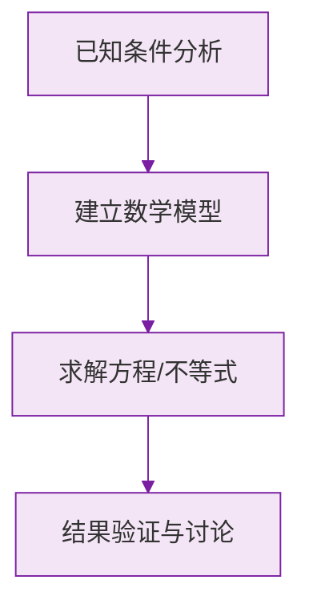

# 正数和负数

标签：#中考必考 #基础

## 一、为什么需要负数

生活中有许多**具有相反意义的量**：气温零上 3℃ 与零下 3℃、收入 500 元与支出 500 元、海平面以上与以下……只用小学学过的数（正数和 0）不够用了，于是引入**负数**。

- 像 $3$、$1.8\%$、$\frac{5}{2}$ 这样**大于 0 的数**叫做**正数**；
- 在正数前面加上符号 "$-$"（负号）的数叫做**负数**，如 $-3$、$-0.5$、$-\frac{2}{7}$。

> 💡 **理解要点**：正数前面可以加 "$+$" 号强调（如 $+3$），通常省略不写；负数的 "$-$" 号**不能省略**。

## 二、0 的特殊地位

**$0$ 既不是正数，也不是负数。**

$0$ 是正数和负数的分界，它的意义很丰富：

| 情境 | 0 的含义 |
|---|---|
| 温度 | 0℃ 是一个确定的温度（冰水混合物），不是"没有温度" |
| 海拔 | 0 米表示海平面 |
| 收支 | 0 元表示收支平衡 |

> ⚠️ **易错点**："0 表示没有" 是小学的旧观念，初中必须更新：0 是一个实实在在的数。

## 三、用正负数表示相反意义的量

用正负数表示相反意义的量时，先规定**哪一方为正**，另一方就用负数表示。

例如规定向东为正：

- 向东走 5 米记作 $+5$ 米；
- 向西走 3 米记作 $-3$ 米。

> ⚠️ **易错点**：题目说"记水位上升 2 cm 为 $+2$ cm"，那么"$-3$ cm"表示水位**下降 3 cm**，而不是"上升 $-3$ cm"。答题时要把负号翻译成相反的意义。

## 四、要点小结

1. 大于 0 的数是正数；在正数前加 "$-$" 得到负数；
2. $0$ 既不是正数也不是负数；
3. 正数与负数表示**相反意义**的量，"基准"（规定谁为正）必须先明确；
4. 一个数前面的 "$+$""$-$" 叫做它的**符号**。

## 五、知识联系

- 引入负数后，数的家族扩大了，下一节 [[有理数（概念与数轴、相反数、绝对值）]] 将给这些数一个统一的名字和分类；
- [[数轴]] 会把正数、0、负数直观地排在一条直线上。

### 数学几何与函数分析

<svg xmlns="http://www.w3.org/2000/svg" viewBox="0 0 300 200" style="background-color: #f3e5f5; border: 1px solid #7b1fa2; border-radius: 8px;">
  <line x1="20" y1="180" x2="280" y2="180" stroke="#7b1fa2" stroke-width="2" />
  <line x1="50" y1="20" x2="50" y2="180" stroke="#7b1fa2" stroke-width="2" />
  <path d="M50,180 Q150,20 280,180" fill="none" stroke="#9c27b0" stroke-width="3" />
  <text x="260" y="195" fill="#7b1fa2" font-size="12">X轴</text>
  <text x="10" y="30" fill="#7b1fa2" font-size="12">Y轴</text>
  <text x="140" y="100" fill="#7b1fa2" font-size="14">抛物线图示</text>
</svg>

