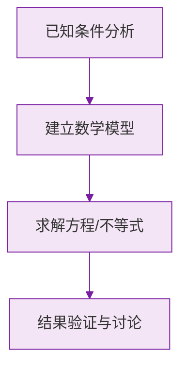

# 例题 · 有理数

## 例题 1（基础 · 概念辨析）

### 题目

下列说法中正确的是（　　）

A. 一个数的相反数一定是负数
B. $0$ 既不是正数也不是负数
C. 绝对值等于本身的数只有正数
D. $\pi$ 是有理数

### 解析

逐项分析：

- A 错误。正数的相反数是负数，但**负数的相反数是正数**，$0$ 的相反数是 $0$。
- B **正确**。这是 $0$ 的基本属性，必须牢记。
- C 错误。绝对值等于本身的数是**正数和 $0$**（非负数）。
- D 错误。$\pi$ 是无限不循环小数，不是有理数。

**答案：B**

---

## 例题 2（中档 · 绝对值化简）

### 题目

已知 $|a - 2| + |b + 3| = 0$，求 $a + b$ 的值。

### 解析

由绝对值的**非负性**可知 $|a-2| \ge 0$，$|b+3| \ge 0$。

两个非负数之和为 $0$，则每一个都必须为 $0$：

$$
|a - 2| = 0 \implies a = 2
$$

$$
|b + 3| = 0 \implies b = -3
$$

所以：

$$
a + b = 2 + (-3) = -1
$$

**答案：$-1$**

> 💡 「若干个非负数之和为 0，则各个都为 0」是初中阶段的高频套路，绝对值、平方、算术平方根都具有非负性。

---

## 例题 3（提高 · 数轴与距离）

### 题目

数轴上点 $A$ 表示的数为 $-4$，点 $B$ 表示的数为 $2$。点 $P$ 在数轴上，且 $PA = 2PB$（$PA$ 表示 $P$ 到 $A$ 的距离），求点 $P$ 表示的数。

### 解析

设点 $P$ 表示的数为 $x$，则 $PA = |x - (-4)| = |x+4|$，$PB = |x - 2|$。

由条件 $PA = 2PB$：

$$
|x + 4| = 2|x - 2|
$$

**分类讨论**（按 $P$ 的位置分三段）：

1. 当 $x < -4$ 时：$-(x+4) = 2(2 - x)$，解得 $x = 8$，与 $x<-4$ 矛盾，舍去。
2. 当 $-4 \le x \le 2$ 时：$x + 4 = 2(2 - x)$，解得 $3x = 0$，即 $x = 0$，符合范围。✔
3. 当 $x > 2$ 时：$x + 4 = 2(x - 2)$，解得 $x = 8$，符合范围。✔

**答案：点 $P$ 表示的数为 $0$ 或 $8$**

> ⚠️ 涉及数轴上的距离问题，**分类讨论**是关键，最后一定要检验解是否落在所设范围内。

### 数学几何与函数分析

<svg xmlns="http://www.w3.org/2000/svg" viewBox="0 0 300 200" style="background-color: #f3e5f5; border: 1px solid #7b1fa2; border-radius: 8px;">
  <line x1="20" y1="180" x2="280" y2="180" stroke="#7b1fa2" stroke-width="2" />
  <line x1="50" y1="20" x2="50" y2="180" stroke="#7b1fa2" stroke-width="2" />
  <path d="M50,180 Q150,20 280,180" fill="none" stroke="#9c27b0" stroke-width="3" />
  <text x="260" y="195" fill="#7b1fa2" font-size="12">X轴</text>
  <text x="10" y="30" fill="#7b1fa2" font-size="12">Y轴</text>
  <text x="140" y="100" fill="#7b1fa2" font-size="14">抛物线图示</text>
</svg>

