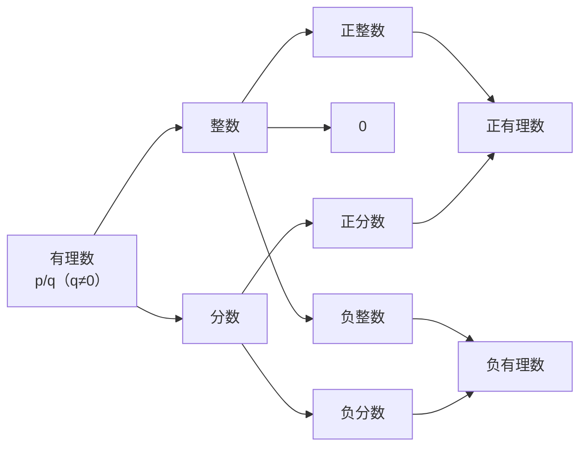

# 公式与定义卡片 · 有理数

## 知识结构

## 1. 有理数的定义

$$
\text{有理数} = \left\{ \frac{p}{q} \;\middle|\; p, q \text{ 为整数}, q \neq 0 \right\}
$$

即：整数与分数统称有理数。

## 2. 相反数

$a$ 的相反数为 $-a$，且满足：

$$
a + (-a) = 0
$$

相反数的相反数是它本身：

$$
-(-a) = a
$$

## 3. 绝对值（分段定义）

$$
|a| =
\begin{cases}
a, & a > 0 \\
0, & a = 0 \\
-a, & a < 0
\end{cases}
$$

## 4. 绝对值的非负性

$$
|a| \ge 0
$$

若几个非负数之和为 $0$，则每个都为 $0$：

$$
|a| + |b| = 0 \implies a = 0 \text{ 且 } b = 0
$$

## 5. 数轴上两点间的距离

数轴上表示 $a$、$b$ 两数的点之间的距离：

$$
d = |a - b|
$$

## 6. 比较大小

- 数轴上右边的数大于左边的数；
- 两个负数比较：$|a| > |b| \implies a < b$（当 $a, b < 0$ 时）。
