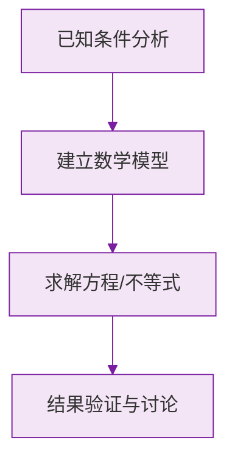

# 有理数（概念与数轴、相反数、绝对值）

标签：#中考必考 #基础 #易错

## 一、有理数的概念

**整数和分数统称为有理数**。

有理数的分类（按定义）：

- 整数
  - 正整数：$1, 2, 3, \dots$
  - 零：$0$
  - 负整数：$-1, -2, -3, \dots$
- 分数
  - 正分数：$\frac{1}{2}, 0.7, 25\%$
  - 负分数：$-\frac{1}{3}, -0.5$

> ⚠️ **易错点**：有限小数和无限循环小数都可以化成分数，所以它们**都是有理数**；而 $\pi$ 是无限不循环小数，**不是**有理数（初一下学习「实数」时会认识它是无理数）。

有理数的分类（按正负）：

| 分类 | 包含 |
|---|---|
| 正有理数 | 正整数、正分数 |
| 零 | $0$（既不是正数，也不是负数） |
| 负有理数 | 负整数、负分数 |

## 二、数轴

**规定了原点、正方向和单位长度的直线叫做数轴。**

三要素缺一不可：

1. **原点**——表示 $0$ 的点；
2. **正方向**——通常向右为正；
3. **单位长度**——刻度间距。

重要结论：

- 任何一个有理数都可以用数轴上的一个点表示；
- 数轴上，**右边的数总比左边的数大**；
- 正数都大于 $0$，负数都小于 $0$，正数大于一切负数。

## 三、相反数

**只有符号不同的两个数互为相反数**。例如 $5$ 与 $-5$、$-\frac{2}{3}$ 与 $\frac{2}{3}$。

- $0$ 的相反数是 $0$（唯一一个相反数是它本身的数）；
- 在数轴上，互为相反数的两个点位于原点两侧，且**到原点的距离相等**；
- $a$ 的相反数是 $-a$。注意 $-a$ 不一定是负数：当 $a<0$ 时，$-a>0$。

> ⚠️ **易错点**：「$-a$ 一定是负数」是典型错误说法。字母 $a$ 可以代表任何有理数。

## 四、绝对值

**数轴上表示数 $a$ 的点与原点的距离**叫做 $a$ 的绝对值，记作 $|a|$。

- 正数的绝对值是它本身；
- 负数的绝对值是它的相反数；
- $0$ 的绝对值是 $0$。

重要性质：

- $|a| \ge 0$（绝对值具有**非负性**）；
- 两个负数比较大小：**绝对值大的反而小**。例如 $-3 < -2$，因为 $|-3| > |-2|$。

> 💡 **理解要点**：绝对值的本质是「距离」，距离不可能是负数——这就是非负性的来源。

## 五、知识联系

- 本节是整个初中「数与代数」的地基：[[有理数的加减法]] 的符号法则完全建立在数轴和绝对值之上。
- 初一下 [[8.3 实数及其简单运算|「实数」]] 会把数的范围从有理数扩充到实数，数轴上的点将与实数一一对应。

### 数学几何与函数分析

<svg xmlns="http://www.w3.org/2000/svg" viewBox="0 0 300 200" style="background-color: #f3e5f5; border: 1px solid #7b1fa2; border-radius: 8px;">
  <line x1="20" y1="180" x2="280" y2="180" stroke="#7b1fa2" stroke-width="2" />
  <line x1="50" y1="20" x2="50" y2="180" stroke="#7b1fa2" stroke-width="2" />
  <path d="M50,180 Q150,20 280,180" fill="none" stroke="#9c27b0" stroke-width="3" />
  <text x="260" y="195" fill="#7b1fa2" font-size="12">X轴</text>
  <text x="10" y="30" fill="#7b1fa2" font-size="12">Y轴</text>
  <text x="140" y="100" fill="#7b1fa2" font-size="14">抛物线图示</text>
</svg>

