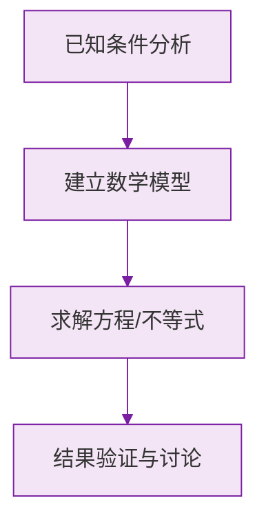

# 例题 · 数轴

## 例题 1（基础 · 三要素辨析）

### 题目

下列关于数轴的说法正确的是（　　）

A. 有原点和正方向的直线是数轴
B. 数轴上离原点越远的点表示的数越大
C. 数轴上表示 $-2$ 的点在原点左侧 2 个单位长度处
D. 所有有理数都在原点右侧

### 解析

- A 错误：缺少**单位长度**，三要素不全；
- B 错误：左侧离原点越远的数越**小**（如 $-100$ 离原点很远却很小）；
- C **正确**：负数在原点左侧，距离为其绝对值；
- D 错误：负数都在原点左侧。

**答案：C**

---

## 例题 2（基础 · 点的移动）

### 题目

数轴上点 $A$ 表示 $-3$。将点 $A$ 先向右移动 5 个单位长度，再向左移动 2 个单位长度，此时点 $A$ 表示的数是多少？

### 解析

右移加、左移减：

$$
-3 + 5 - 2 = 0
$$

**答案：$0$**

> 💡 移动问题不必画图逐格数，直接"右加左减"列算式即可。

---

## 例题 3（中档 · 距离问题）

### 题目

数轴上点 $M$ 表示的数为 $x$，且点 $M$ 到表示 $1$ 的点的距离为 4。求 $x$ 的值。

### 解析

"到表示 1 的点的距离为 4"即：

$$
|x - 1| = 4
$$

点 $M$ 可能在 1 的左边或右边：

- 在右边：$x = 1 + 4 = 5$；
- 在左边：$x = 1 - 4 = -3$。

**答案：$x = 5$ 或 $x = -3$**

> ⚠️ 距离问题一般有**两个解**，只答一个是最常见的丢分点。

---

## 例题 4（提高 · 动点综合）

### 题目

数轴上点 $A$ 表示 $-6$，点 $B$ 表示 $4$。动点 $P$ 从点 $A$ 出发，以每秒 2 个单位长度的速度沿数轴向右运动。问几秒后 $PB = 3$？

### 解析

设运动 $t$ 秒后，点 $P$ 表示的数为 $-6 + 2t$。

$PB = 3$ 即：

$$
|(-6 + 2t) - 4| = 3 \implies |2t - 10| = 3
$$

分两种情况：

1. $2t - 10 = 3$，解得 $t = 6.5$；
2. $2t - 10 = -3$，解得 $t = 3.5$。

两个时刻都在 $t \ge 0$ 范围内，均符合题意。

**答案：$3.5$ 秒或 $6.5$ 秒后 $PB = 3$**

> 💡 动点问题的通法：用时间 $t$ 表示动点位置，再用 $|a-b|$ 表示距离，列方程求解。

### 数学几何与函数分析

<svg xmlns="http://www.w3.org/2000/svg" viewBox="0 0 300 200" style="background-color: #f3e5f5; border: 1px solid #7b1fa2; border-radius: 8px;">
  <line x1="20" y1="180" x2="280" y2="180" stroke="#7b1fa2" stroke-width="2" />
  <line x1="50" y1="20" x2="50" y2="180" stroke="#7b1fa2" stroke-width="2" />
  <path d="M50,180 Q150,20 280,180" fill="none" stroke="#9c27b0" stroke-width="3" />
  <text x="260" y="195" fill="#7b1fa2" font-size="12">X轴</text>
  <text x="10" y="30" fill="#7b1fa2" font-size="12">Y轴</text>
  <text x="140" y="100" fill="#7b1fa2" font-size="14">抛物线图示</text>
</svg>

