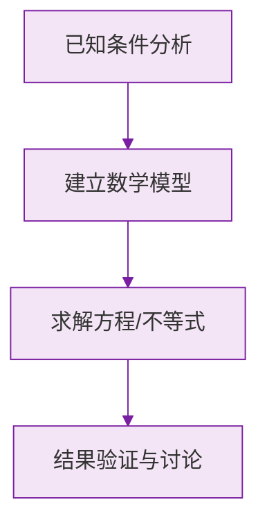

# 公式与定义卡片 · 数轴

## 1. 数轴三要素

$$
\text{数轴} = \text{原点} + \text{正方向} + \text{单位长度}
$$

## 2. 大小比较法则

数轴上，右边的数大于左边的数：

$$
a \text{ 在 } b \text{ 右侧} \iff a > b
$$

## 3. 点的移动

表示数 $a$ 的点：

$$
\text{右移 } m \text{ 个单位} \to a + m, \qquad \text{左移 } m \text{ 个单位} \to a - m
$$

## 4. 两点间距离

数轴上表示 $a$、$b$ 的两点之间的距离：

$$
d = |a - b|
$$

## 5. 中点公式

数轴上表示 $a$、$b$ 的两点的中点表示的数：

$$
x_{\text{中}} = \frac{a + b}{2}
$$

### 数学几何与函数分析

<svg xmlns="http://www.w3.org/2000/svg" viewBox="0 0 300 200" style="background-color: #f3e5f5; border: 1px solid #7b1fa2; border-radius: 8px;">
  <line x1="20" y1="180" x2="280" y2="180" stroke="#7b1fa2" stroke-width="2" />
  <line x1="50" y1="20" x2="50" y2="180" stroke="#7b1fa2" stroke-width="2" />
  <path d="M50,180 Q150,20 280,180" fill="none" stroke="#9c27b0" stroke-width="3" />
  <text x="260" y="195" fill="#7b1fa2" font-size="12">X轴</text>
  <text x="10" y="30" fill="#7b1fa2" font-size="12">Y轴</text>
  <text x="140" y="100" fill="#7b1fa2" font-size="14">抛物线图示</text>
</svg>

