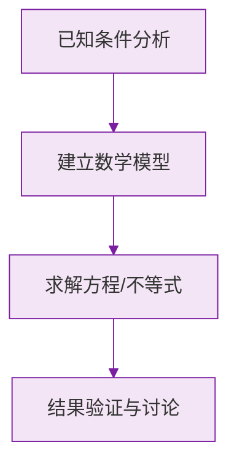

# 数轴

标签：#中考高频 #基础

## 一、数轴的定义

**规定了原点、正方向和单位长度的直线叫做数轴。**

三要素缺一不可：

| 要素 | 作用 |
|---|---|
| **原点** | 表示 $0$ 的点，是"基准" |
| **正方向** | 通常规定向右为正，用箭头表示 |
| **单位长度** | 相邻刻度间的距离，必须均匀 |

> ⚠️ **易错点**：画数轴时忘记箭头、忘记标 0、刻度不均匀，都是"三要素不全"，要扣分。

## 二、数与点的对应

- **任何一个有理数都可以用数轴上的一个点表示**；
- 设一个数在数轴上的对应点为 $P$，正数在原点**右侧**，负数在原点**左侧**；
- 数轴上的点不都是有理数点（以后学的 $\pi$、$\sqrt{2}$ 也在数轴上），初一先记住"有理数 → 点"这一方向即可。

## 三、利用数轴比较大小

**数轴上，右边的数总比左边的数大。**

由此立刻得到三条常用结论：

1. 正数都大于 $0$；
2. 负数都小于 $0$；
3. 正数大于一切负数。

## 四、数轴上的距离与移动

- 表示数 $a$ 的点与原点的距离是 $|a|$（这正是下一节 [[绝对值]] 的定义）；
- 点从表示 $a$ 的位置**向右移动** $m$ 个单位，到达 $a + m$；**向左移动** $m$ 个单位，到达 $a - m$。

> 💡 **理解要点**：数轴把"数"变成"形"，很多难题（动点、距离、大小比较）画一条数轴就一目了然，这是"数形结合"思想的起点。

## 五、要点小结

1. 数轴三要素：原点、正方向、单位长度；
2. 右边的数大于左边的数；
3. 右移加、左移减；
4. 到原点的距离 = 绝对值。

## 六、知识联系

- [[相反数]]在数轴上表现为原点两侧对称的点；
- [[绝对值]]的定义直接依赖数轴上的距离；
- [[有理数的加减法]]可以用数轴上的移动来理解。

### 数学几何与函数分析

<svg xmlns="http://www.w3.org/2000/svg" viewBox="0 0 300 200" style="background-color: #f3e5f5; border: 1px solid #7b1fa2; border-radius: 8px;">
  <line x1="20" y1="180" x2="280" y2="180" stroke="#7b1fa2" stroke-width="2" />
  <line x1="50" y1="20" x2="50" y2="180" stroke="#7b1fa2" stroke-width="2" />
  <path d="M50,180 Q150,20 280,180" fill="none" stroke="#9c27b0" stroke-width="3" />
  <text x="260" y="195" fill="#7b1fa2" font-size="12">X轴</text>
  <text x="10" y="30" fill="#7b1fa2" font-size="12">Y轴</text>
  <text x="140" y="100" fill="#7b1fa2" font-size="14">抛物线图示</text>
</svg>

