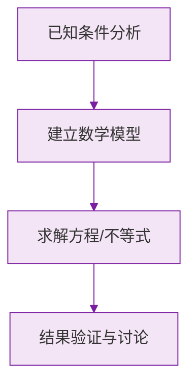

# 例题 · 相反数

## 例题 1（基础 · 求相反数）

### 题目

分别写出下列各数的相反数：$7$，$-2.5$，$\frac{3}{4}$，$0$，$-(-6)$。

### 解析

先把每个数化到最简，再改变符号：

| 原数 | 化简 | 相反数 |
|---|---|---|
| $7$ | $7$ | $-7$ |
| $-2.5$ | $-2.5$ | $2.5$ |
| $\frac{3}{4}$ | $\frac{3}{4}$ | $-\frac{3}{4}$ |
| $0$ | $0$ | $0$ |
| $-(-6)$ | $6$ | $-6$ |

> ⚠️ 求 $-(-6)$ 的相反数，必须**先化简为 6**，再取相反数。

---

## 例题 2（基础 · 概念判断）

### 题目

下列说法正确的是（　　）

A. $-a$ 一定是负数
B. 相反数等于它本身的数只有 $0$
C. 符号不同的两个数互为相反数
D. $\frac{1}{2}$ 的相反数是 $2$

### 解析

- A 错误：当 $a<0$ 时 $-a>0$，当 $a=0$ 时 $-a=0$；
- B **正确**：$0$ 是唯一相反数等于自身的数；
- C 错误：漏掉"数字部分相同"这一条件，如 $3$ 与 $-5$ 符号不同但不是相反数；
- D 错误：$\frac{1}{2}$ 的相反数是 $-\frac{1}{2}$；$2$ 是它的**倒数**。

**答案：B**

> ⚠️ "相反数"与"倒数"是两个完全不同的概念，别混淆。

---

## 例题 3（中档 · 多重符号化简）

### 题目

化简：(1) $-(-(-5))$；(2) $-\left[-\left(+\frac{2}{3}\right)\right]$。

### 解析

数一数负号的个数：

(1) 共 3 个负号（奇数个），结果为负：

$$
-(-(-5)) = -5
$$

(2) 共 2 个负号（偶数个），结果为正：

$$
-\left[-\left(+\frac{2}{3}\right)\right] = \frac{2}{3}
$$

**答案：(1) $-5$；(2) $\frac{2}{3}$**

---

## 例题 4（提高 · 与和为零结合）

### 题目

已知 $a$ 与 $b$ 互为相反数，$c$ 的相反数是 $-2$，求 $a + b + c$ 的值。

### 解析

- $a$ 与 $b$ 互为相反数 $\implies a + b = 0$；
- $c$ 的相反数是 $-2$ $\implies c = 2$。

所以：

$$
a + b + c = 0 + 2 = 2
$$

**答案：$2$**

> 💡 看到"互为相反数"，第一反应就是把两数之和替换为 $0$——整体代入是常用技巧。

### 数学几何与函数分析

<svg xmlns="http://www.w3.org/2000/svg" viewBox="0 0 300 200" style="background-color: #f3e5f5; border: 1px solid #7b1fa2; border-radius: 8px;">
  <line x1="20" y1="180" x2="280" y2="180" stroke="#7b1fa2" stroke-width="2" />
  <line x1="50" y1="20" x2="50" y2="180" stroke="#7b1fa2" stroke-width="2" />
  <path d="M50,180 Q150,20 280,180" fill="none" stroke="#9c27b0" stroke-width="3" />
  <text x="260" y="195" fill="#7b1fa2" font-size="12">X轴</text>
  <text x="10" y="30" fill="#7b1fa2" font-size="12">Y轴</text>
  <text x="140" y="100" fill="#7b1fa2" font-size="14">抛物线图示</text>
</svg>

