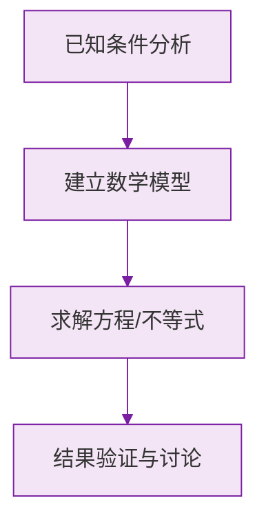

# 公式与定义卡片 · 绝对值

## 1. 分段定义

$$
|a| =
\begin{cases}
a, & a > 0 \\
0, & a = 0 \\
-a, & a < 0
\end{cases}
$$

## 2. 非负性

$$
|a| \ge 0
$$

非负数之和为零则各项皆零：

$$
|a| + |b| = 0 \implies a = b = 0
$$

## 3. 相反数的绝对值

$$
|a| = |-a|
$$

## 4. 解绝对值方程（基本型）

$$
|x| = m \ (m > 0) \implies x = \pm m
$$

## 5. 两负数比较大小

$$
a < 0,\ b < 0,\ |a| > |b| \implies a < b
$$

## 6. 数轴上两点距离

$$
d(a, b) = |a - b|
$$

### 数学几何与函数分析

<svg xmlns="http://www.w3.org/2000/svg" viewBox="0 0 300 200" style="background-color: #f3e5f5; border: 1px solid #7b1fa2; border-radius: 8px;">
  <line x1="20" y1="180" x2="280" y2="180" stroke="#7b1fa2" stroke-width="2" />
  <line x1="50" y1="20" x2="50" y2="180" stroke="#7b1fa2" stroke-width="2" />
  <path d="M50,180 Q150,20 280,180" fill="none" stroke="#9c27b0" stroke-width="3" />
  <text x="260" y="195" fill="#7b1fa2" font-size="12">X轴</text>
  <text x="10" y="30" fill="#7b1fa2" font-size="12">Y轴</text>
  <text x="140" y="100" fill="#7b1fa2" font-size="14">抛物线图示</text>
</svg>

