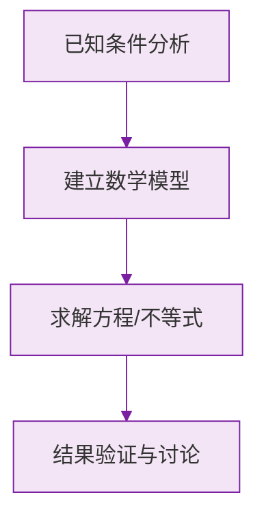

# 绝对值

标签：#中考高频 #基础 #易错

## 一、绝对值的定义

**数轴上表示数 $a$ 的点与原点的距离**，叫做数 $a$ 的绝对值，记作 $|a|$。

例如：$|3| = 3$，$|-3| = 3$，$|0| = 0$。

> 💡 **理解要点**：绝对值的本质是**距离**。距离只关心"多远"，不关心"哪个方向"，所以绝对值永远不会是负数。

## 二、代数意义（分段定义）

$$
|a| =
\begin{cases}
a, & a > 0 \\
0, & a = 0 \\
-a, & a < 0
\end{cases}
$$

用文字表述：

- 正数的绝对值是**它本身**；
- $0$ 的绝对值是 $0$；
- 负数的绝对值是**它的相反数**。

> ⚠️ **易错点**：当 $a < 0$ 时 $|a| = -a$，这里 $-a$ 是**正数**（负数的相反数），不要看到负号就以为结果是负的。

## 三、绝对值的重要性质

1. **非负性**：$|a| \ge 0$，即绝对值最小的数是 $0$；
2. 互为相反数的两个数绝对值**相等**：$|a| = |-a|$；
3. 若 $|a| = |b|$，则 $a = b$ 或 $a = -b$；
4. 若几个非负数之和为 $0$，则每个非负数都为 $0$：

$$
|a| + |b| = 0 \implies a = 0 \text{ 且 } b = 0
$$

## 四、已知绝对值求原数

若 $|x| = 5$，则 $x = 5$ 或 $x = -5$——**绝对值相等的数有两个**（互为相反数），除非绝对值为 0。

| 条件 | 结论 |
|---|---|
| $\lvert x \rvert = 5$ | $x = \pm 5$ |
| $\lvert x \rvert = 0$ | $x = 0$ |
| $\lvert x \rvert = -2$ | 无解（绝对值不可能为负） |

> ⚠️ **易错点**：由 $|x|=5$ 只答 $x=5$，漏掉 $x=-5$，是本节最高频的丢分点。

## 五、利用绝对值比较大小

**两个负数比较大小：绝对值大的反而小。**

例如比较 $-\frac{3}{4}$ 与 $-\frac{2}{3}$：

$$
\left|-\frac{3}{4}\right| = \frac{9}{12} > \frac{8}{12} = \left|-\frac{2}{3}\right| \implies -\frac{3}{4} < -\frac{2}{3}
$$

## 六、知识联系

- 绝对值建立在[[数轴]]的距离概念上，与[[相反数]]紧密关联；
- [[有理数的加减法]]的符号法则要靠"比较绝对值大小"来确定结果的符号；
- [[大小比较]]中两负数的比较完全依赖绝对值。

### 数学几何与函数分析

<svg xmlns="http://www.w3.org/2000/svg" viewBox="0 0 300 200" style="background-color: #f3e5f5; border: 1px solid #7b1fa2; border-radius: 8px;">
  <line x1="20" y1="180" x2="280" y2="180" stroke="#7b1fa2" stroke-width="2" />
  <line x1="50" y1="20" x2="50" y2="180" stroke="#7b1fa2" stroke-width="2" />
  <path d="M50,180 Q150,20 280,180" fill="none" stroke="#9c27b0" stroke-width="3" />
  <text x="260" y="195" fill="#7b1fa2" font-size="12">X轴</text>
  <text x="10" y="30" fill="#7b1fa2" font-size="12">Y轴</text>
  <text x="140" y="100" fill="#7b1fa2" font-size="14">抛物线图示</text>
</svg>

