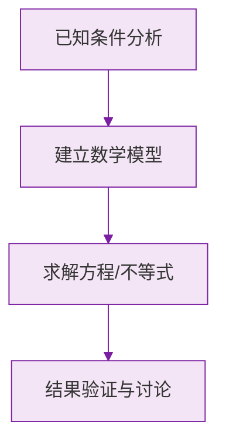

# 例题 · 有理数的大小比较

## 例题 1（基础 · 直接比较）

### 题目

比较下列每组数的大小：

(1) $-3$ 与 $2$；(2) $-\frac{1}{2}$ 与 $-\frac{1}{3}$；(3) $0$ 与 $-0.01$。

### 解析

(1) 正数大于一切负数：$-3 < 2$；

(2) 两负数比绝对值：$\left|-\frac{1}{2}\right| = \frac{3}{6} > \frac{2}{6} = \left|-\frac{1}{3}\right|$，绝对值大的反而小：

$$
-\frac{1}{2} < -\frac{1}{3}
$$

(3) 负数都小于 $0$：$0 > -0.01$。

---

## 例题 2（基础 · 排序）

### 题目

把下列各数用"$<$"连接：$-2.5,\ \ 3,\ \ 0,\ \ -\frac{5}{2},\ \ 1$。

### 解析

先观察：$-2.5 = -\frac{5}{2}$，两数**相等**。

分类：负数组 $-2.5 = -\frac{5}{2}$；零；正数组 $1 < 3$。

$$
-2.5 = -\frac{5}{2} < 0 < 1 < 3
$$

> ⚠️ 排序前先化简、化同形式，注意可能出现相等的数。

---

## 例题 3（中档 · 作差法）

### 题目

比较 $\frac{7}{9}$ 与 $\frac{8}{10}$ 的大小。

### 解析

作差：

$$
\frac{7}{9} - \frac{8}{10} = \frac{70}{90} - \frac{72}{90} = -\frac{2}{90} < 0
$$

所以：

$$
\frac{7}{9} < \frac{8}{10}
$$

**答案：$\frac{7}{9} < \frac{8}{10}$**

> 💡 作差法是"万能钥匙"，尤其适合分数、字母式的大小比较。

---

## 例题 4（提高 · 字母比较与分类）

### 题目

已知 $a < 0$，试比较 $a$、$-a$、$\frac{a}{2}$ 三个数的大小。

### 解析

取特殊值检验思路：设 $a = -2$，则 $-a = 2$，$\frac{a}{2} = -1$，有 $-2 < -1 < 2$。

一般证明：

- $a < 0$ 时，$-a > 0$，所以 $-a$ 最大；
- $a$ 与 $\frac{a}{2}$ 都是负数，$|a| = -a > -\frac{a}{2} = \left|\frac{a}{2}\right|$，绝对值大的反而小，所以 $a < \frac{a}{2}$。

**答案：$a < \dfrac{a}{2} < -a$**

> 💡 含字母比较大小，"特殊值探路 + 法则证明"双管齐下最稳妥。

### 数学几何与函数分析

<svg xmlns="http://www.w3.org/2000/svg" viewBox="0 0 300 200" style="background-color: #f3e5f5; border: 1px solid #7b1fa2; border-radius: 8px;">
  <line x1="20" y1="180" x2="280" y2="180" stroke="#7b1fa2" stroke-width="2" />
  <line x1="50" y1="20" x2="50" y2="180" stroke="#7b1fa2" stroke-width="2" />
  <path d="M50,180 Q150,20 280,180" fill="none" stroke="#9c27b0" stroke-width="3" />
  <text x="260" y="195" fill="#7b1fa2" font-size="12">X轴</text>
  <text x="10" y="30" fill="#7b1fa2" font-size="12">Y轴</text>
  <text x="140" y="100" fill="#7b1fa2" font-size="14">抛物线图示</text>
</svg>

