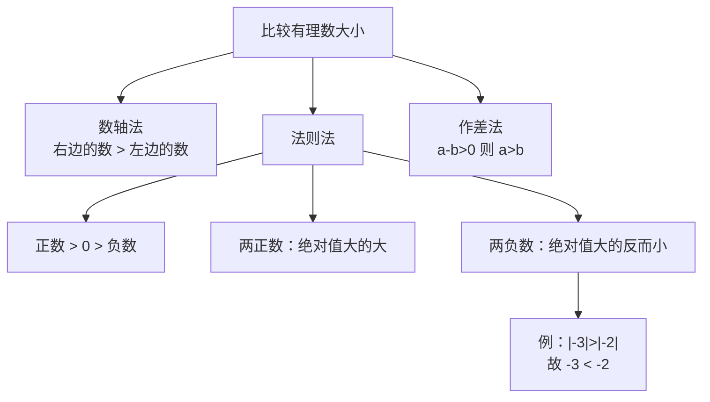

# 公式与定义卡片 · 有理数的大小比较

## 知识结构

## 1. 数轴法则

$$
a \text{ 在 } b \text{ 的右侧} \iff a > b
$$

## 2. 符号法则

$$
\text{正数} > 0 > \text{负数}
$$

## 3. 两负数比较

$$
a < 0,\ b < 0:\quad |a| > |b| \iff a < b
$$

## 4. 作差法

$$
a - b > 0 \iff a > b
$$

$$
a - b = 0 \iff a = b
$$

$$
a - b < 0 \iff a < b
$$

## 5. 倒数比较（同为正数时）

$$
0 < a < b \implies \frac{1}{a} > \frac{1}{b}
$$
