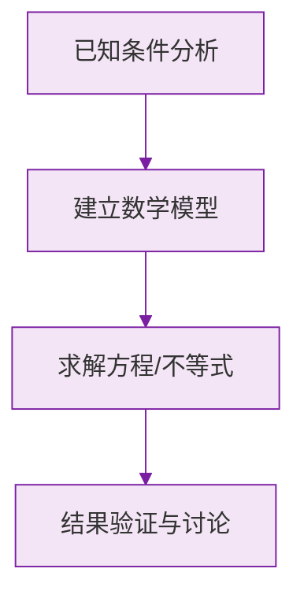

# 有理数的大小比较

标签：#中考高频 #基础

## 一、两种基本方法

### 方法 1：数轴法

**数轴上，右边的数总比左边的数大。**

把要比较的数在数轴上标出来，从左到右依次增大。这个方法直观，适合多个数排序。

### 方法 2：法则法

1. 正数都大于 $0$，负数都小于 $0$，正数大于一切负数；
2. 两个正数，绝对值大的大（小学已会）；
3. **两个负数，绝对值大的反而小**。

> ⚠️ **易错点**：法则 3 是初一新增、最易出错的：$-100 < -1$，虽然 $100$ 看着大，但"欠得越多越穷"。

## 二、常用技巧

| 技巧 | 适用场景 | 说明 |
|---|---|---|
| 通分比较 | 分数之间 | 化成同分母再比分子 |
| 化小数比较 | 分数与小数混合 | 都化成小数直接看 |
| 作差法 | 任意两数 | $a - b > 0 \iff a > b$ |
| 中间值 | 一正一负或跨 0 | 与 $0$、$1$、$-1$ 比 |

## 三、多个数排序的步骤

1. **分类**：先把数分成正数、$0$、负数三组；
2. **组内排序**：正数按大小排，负数按"绝对值大的反而小"排；
3. **拼接**：负数 < $0$ < 正数。

例：把 $-\frac{1}{2},\ 0,\ 3,\ -2,\ 1.5$ 从小到大排列。

- 负数组：$|-2| > \left|-\frac{1}{2}\right|$，故 $-2 < -\frac{1}{2}$；
- 正数组：$1.5 < 3$；
- 结果：$-2 < -\frac{1}{2} < 0 < 1.5 < 3$。

## 四、要点小结

1. 数轴上右边的数大；
2. 正数 > 0 > 负数；
3. 两负数比较，绝对值大的反而小；
4. 排序先分类再拼接，不等号方向要统一。

## 五、知识联系

- 本节综合运用[[数轴]]和[[绝对值]]的知识；
- 后续[[有理数的加减法]]运算结果常需要比较大小验证合理性。

### 数学几何与函数分析

<svg xmlns="http://www.w3.org/2000/svg" viewBox="0 0 300 200" style="background-color: #f3e5f5; border: 1px solid #7b1fa2; border-radius: 8px;">
  <line x1="20" y1="180" x2="280" y2="180" stroke="#7b1fa2" stroke-width="2" />
  <line x1="50" y1="20" x2="50" y2="180" stroke="#7b1fa2" stroke-width="2" />
  <path d="M50,180 Q150,20 280,180" fill="none" stroke="#9c27b0" stroke-width="3" />
  <text x="260" y="195" fill="#7b1fa2" font-size="12">X轴</text>
  <text x="10" y="30" fill="#7b1fa2" font-size="12">Y轴</text>
  <text x="140" y="100" fill="#7b1fa2" font-size="14">抛物线图示</text>
</svg>

