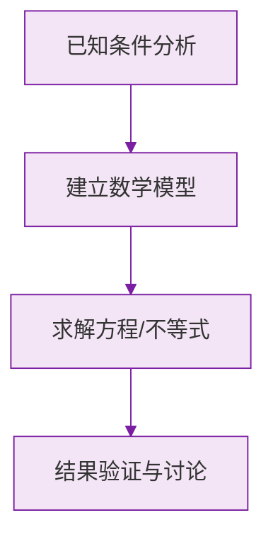

# 例题 · 有理数的加减法

## 例题 1（基础 · 直接计算）

### 题目

计算：

(1) $(-12) + (-8)$
(2) $(-15) + 9$
(3) $7 - (-3)$

### 解析

(1) 同号相加，取负号，绝对值相加：

$$
(-12) + (-8) = -(12 + 8) = -20
$$

(2) 异号相加，$|-15| > |9|$，取负号，大绝对值减小绝对值：

$$
(-15) + 9 = -(15 - 9) = -6
$$

(3) 减去负数等于加上它的相反数：

$$
7 - (-3) = 7 + 3 = 10
$$

**答案：(1) $-20$；(2) $-6$；(3) $10$**

---

## 例题 2（中档 · 简便运算）

### 题目

计算：$(-6.5) + 3\frac{1}{4} + 6.5 + (-4\frac{1}{4})$

### 解析

利用加法交换律和结合律，把互为相反数的、同分母的分别结合：

$$
\begin{aligned}
原式 &= \left[(-6.5) + 6.5\right] + \left[3\tfrac{1}{4} + (-4\tfrac{1}{4})\right] \\
&= 0 + (-1) \\
&= -1
\end{aligned}
$$

**答案：$-1$**

> 💡 简便运算三凑：凑零（相反数）、凑整、凑同分母。

---

## 例题 3（提高 · 实际应用）

### 题目

某检修小组乘汽车沿公路检修线路，规定向东为正、向西为负。某天从出发点起行驶记录（单位：千米）为：

$$
+10,\; -3,\; +4,\; +2,\; -8,\; +13,\; -2,\; -11,\; +7,\; -5
$$

(1) 收工时小组在出发点的哪个方向？距出发点多远？
(2) 若汽车每千米耗油 0.2 升，这一天共耗油多少升？

### 解析

(1) 求最终位置：把所有记录**求和**（正负相消）：

$$
10 - 3 + 4 + 2 - 8 + 13 - 2 - 11 + 7 - 5 = 7
$$

结果为 $+7$，即收工时在出发点**东边 7 千米**处。

(2) 耗油看的是**总路程**，与方向无关，所以取每段的**绝对值**求和：

$$
10 + 3 + 4 + 2 + 8 + 13 + 2 + 11 + 7 + 5 = 65 \text{（千米）}
$$

耗油量：

$$
65 \times 0.2 = 13 \text{（升）}
$$

**答案：(1) 东边 7 千米；(2) 13 升**

> ⚠️ **易错点**：位置用「代数和」，路程/耗油用「绝对值之和」，两者不能混淆。

### 数学几何与函数分析

<svg xmlns="http://www.w3.org/2000/svg" viewBox="0 0 300 200" style="background-color: #f3e5f5; border: 1px solid #7b1fa2; border-radius: 8px;">
  <line x1="20" y1="180" x2="280" y2="180" stroke="#7b1fa2" stroke-width="2" />
  <line x1="50" y1="20" x2="50" y2="180" stroke="#7b1fa2" stroke-width="2" />
  <path d="M50,180 Q150,20 280,180" fill="none" stroke="#9c27b0" stroke-width="3" />
  <text x="260" y="195" fill="#7b1fa2" font-size="12">X轴</text>
  <text x="10" y="30" fill="#7b1fa2" font-size="12">Y轴</text>
  <text x="140" y="100" fill="#7b1fa2" font-size="14">抛物线图示</text>
</svg>

