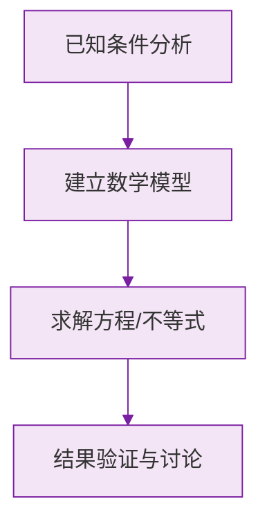

# 公式与法则卡片 · 有理数的加减法

## 1. 同号相加

$$
(+a) + (+b) = +(a+b), \qquad (-a) + (-b) = -(a+b) \quad (a, b > 0)
$$

## 2. 异号相加（设 $a > b > 0$）

$$
(+a) + (-b) = +(a - b), \qquad (-a) + (+b) = -(a - b)
$$

## 3. 相反数相加

$$
a + (-a) = 0
$$

## 4. 与零相加

$$
a + 0 = a
$$

## 5. 加法交换律与结合律

$$
a + b = b + a
$$

$$
(a + b) + c = a + (b + c)
$$

## 6. 减法法则（核心）

$$
a - b = a + (-b)
$$

## 7. 常用变形

$$
a - (-b) = a + b
$$

$$
-a - b = -(a + b)
$$

### 数学几何与函数分析

<svg xmlns="http://www.w3.org/2000/svg" viewBox="0 0 300 200" style="background-color: #f3e5f5; border: 1px solid #7b1fa2; border-radius: 8px;">
  <line x1="20" y1="180" x2="280" y2="180" stroke="#7b1fa2" stroke-width="2" />
  <line x1="50" y1="20" x2="50" y2="180" stroke="#7b1fa2" stroke-width="2" />
  <path d="M50,180 Q150,20 280,180" fill="none" stroke="#9c27b0" stroke-width="3" />
  <text x="260" y="195" fill="#7b1fa2" font-size="12">X轴</text>
  <text x="10" y="30" fill="#7b1fa2" font-size="12">Y轴</text>
  <text x="140" y="100" fill="#7b1fa2" font-size="14">抛物线图示</text>
</svg>

