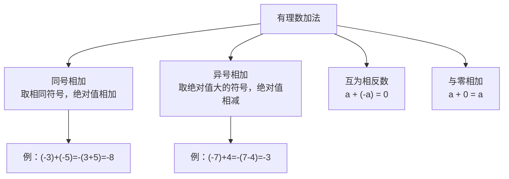

# 公式与法则卡片 · 有理数的加减法

## 知识结构

## 1. 同号相加

$$
(+a) + (+b) = +(a+b), \qquad (-a) + (-b) = -(a+b) \quad (a, b > 0)
$$

## 2. 异号相加（设 $a > b > 0$）

$$
(+a) + (-b) = +(a - b), \qquad (-a) + (+b) = -(a - b)
$$

## 3. 相反数相加

$$
a + (-a) = 0
$$

## 4. 与零相加

$$
a + 0 = a
$$

## 5. 加法交换律与结合律

$$
a + b = b + a
$$

$$
(a + b) + c = a + (b + c)
$$

## 6. 减法法则（核心）

$$
a - b = a + (-b)
$$

## 7. 常用变形

$$
a - (-b) = a + b
$$

$$
-a - b = -(a + b)
$$
