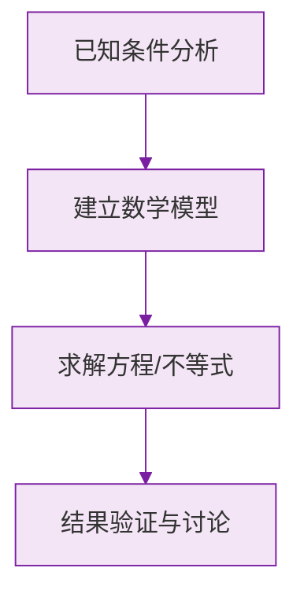

# 有理数的加减法

标签：#中考必考 #基础 #易错 #需大量练习

## 一、有理数加法法则

1. **同号两数相加**：取相同的符号，并把绝对值相加。
   例：$(-3) + (-5) = -(3+5) = -8$
2. **异号两数相加**：绝对值不相等时，取**绝对值较大**的加数的符号，并用较大的绝对值减去较小的绝对值。
   例：$(-7) + 4 = -(7-4) = -3$
3. **互为相反数的两数相加得 $0$**：$a + (-a) = 0$
4. **一个数同 $0$ 相加**，仍得这个数。

> ⚠️ **易错点**：异号相加时，先比较**绝对值**大小定符号，再做减法。很多同学直接把两数相加导致符号错误。

## 二、加法运算律

- **交换律**：$a + b = b + a$
- **结合律**：$(a + b) + c = a + (b + c)$

**简便运算技巧**：

1. 互为相反数的先结合（凑零）；
2. 同号的先结合；
3. 同分母 / 能凑整的先结合。

## 三、有理数减法法则

**减去一个数，等于加上这个数的相反数**：

$$a - b = a + (-b)$$

例：$3 - (-4) = 3 + 4 = 7$

> 💡 **理解要点**：减法法则把减法统一转化为加法，从此加减混合运算可以写成「省略括号的和的形式」，如 $-3 + 5 - 8 = (-3) + 5 + (-8)$。

## 四、加减混合运算步骤

1. 把减法都化为加法（写成省略加号的和的形式）；
2. 运用交换律、结合律简化；
3. 按加法法则计算。

## 五、知识联系

- 前置：[[有理数（概念与数轴、相反数、绝对值）|有理数概念、数轴、绝对值]]——符号法则完全依赖绝对值比较；
- 后继：[[有理数的乘除法]]、[[4.2 整式的加法与减法|整式加减]]（合并同类项本质就是系数的加减）。

### 数学几何与函数分析

<svg xmlns="http://www.w3.org/2000/svg" viewBox="0 0 300 200" style="background-color: #f3e5f5; border: 1px solid #7b1fa2; border-radius: 8px;">
  <line x1="20" y1="180" x2="280" y2="180" stroke="#7b1fa2" stroke-width="2" />
  <line x1="50" y1="20" x2="50" y2="180" stroke="#7b1fa2" stroke-width="2" />
  <path d="M50,180 Q150,20 280,180" fill="none" stroke="#9c27b0" stroke-width="3" />
  <text x="260" y="195" fill="#7b1fa2" font-size="12">X轴</text>
  <text x="10" y="30" fill="#7b1fa2" font-size="12">Y轴</text>
  <text x="140" y="100" fill="#7b1fa2" font-size="14">抛物线图示</text>
</svg>

