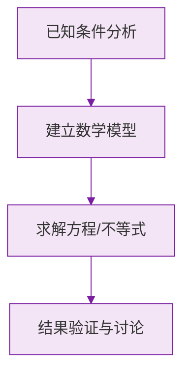

# 例题 · 有理数的乘除法

## 例题 1（基础 · 符号判断）

### 题目

计算：

(1) $(-2) \times (-3) \times (-5)$
(2) $(-\frac{3}{4}) \div (-\frac{3}{8})$

### 解析

(1) 三个负因数，负因数个数为奇数，积为负：

$$
(-2) \times (-3) \times (-5) = -(2 \times 3 \times 5) = -30
$$

(2) 除以一个数等于乘它的倒数，同号得正：

$$
\left(-\frac{3}{4}\right) \div \left(-\frac{3}{8}\right) = \frac{3}{4} \times \frac{8}{3} = 2
$$

**答案：(1) $-30$；(2) $2$**

---

## 例题 2（中档 · 分配律简算）

### 题目

计算：$\left(\frac{1}{2} - \frac{2}{3} + \frac{3}{4}\right) \times (-12)$

### 解析

用分配律把 $-12$ 分别乘进去，避免先通分：

$$
\begin{aligned}
原式 &= \frac{1}{2} \times (-12) - \frac{2}{3} \times (-12) + \frac{3}{4} \times (-12) \\
&= -6 + 8 - 9 \\
&= -7
\end{aligned}
$$

**答案：$-7$**

> 💡 括号内是分数和差、括号外是分母们的公倍数时，分配律几乎总是最快路径。

---

## 例题 3（提高 · 混合运算）

### 题目

计算：$-1^{4} - \left(1 - 0.5\right) \times \frac{1}{3} \times \left[2 - (-3)^{2}\right]$

### 解析

严格按运算顺序，注意两个高频易错符号：

- $-1^4 = -(1^4) = -1$（**不是** $(-1)^4 = 1$，乘方优先于取负号）；
- $(-3)^2 = 9$。

分步计算：

$$
\begin{aligned}
原式 &= -1 - 0.5 \times \frac{1}{3} \times (2 - 9) \\
&= -1 - \frac{1}{2} \times \frac{1}{3} \times (-7) \\
&= -1 - \left(-\frac{7}{6}\right) \\
&= -1 + \frac{7}{6} \\
&= \frac{1}{6}
\end{aligned}
$$

**答案：$\dfrac{1}{6}$**

> ⚠️ **易错点**：$-1^4$ 与 $(-1)^4$ 的区别是初一上学期考试的最爱，务必分清底数到底是 $-1$ 还是 $1$。

### 数学几何与函数分析

<svg xmlns="http://www.w3.org/2000/svg" viewBox="0 0 300 200" style="background-color: #f3e5f5; border: 1px solid #7b1fa2; border-radius: 8px;">
  <line x1="20" y1="180" x2="280" y2="180" stroke="#7b1fa2" stroke-width="2" />
  <line x1="50" y1="20" x2="50" y2="180" stroke="#7b1fa2" stroke-width="2" />
  <path d="M50,180 Q150,20 280,180" fill="none" stroke="#9c27b0" stroke-width="3" />
  <text x="260" y="195" fill="#7b1fa2" font-size="12">X轴</text>
  <text x="10" y="30" fill="#7b1fa2" font-size="12">Y轴</text>
  <text x="140" y="100" fill="#7b1fa2" font-size="14">抛物线图示</text>
</svg>

