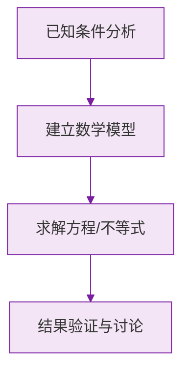

# 公式与法则卡片 · 有理数的乘除法

## 1. 乘法符号法则

$$
(+) \times (+) = (+), \quad (-) \times (-) = (+)
$$

$$
(+) \times (-) = (-), \quad (-) \times (+) = (-)
$$

## 2. 与零相乘

$$
a \times 0 = 0
$$

## 3. 多因数乘积的符号

设 $n$ 为负因数个数（各因数均非零）：

$$
\text{积的符号} =
\begin{cases}
+, & n \text{ 为偶数} \\
-, & n \text{ 为奇数}
\end{cases}
$$

## 4. 倒数

$$
a \cdot \frac{1}{a} = 1 \quad (a \neq 0)
$$

## 5. 乘法运算律

$$
ab = ba
$$

$$
(ab)c = a(bc)
$$

$$
a(b + c) = ab + ac
$$

## 6. 除法法则

$$
a \div b = a \cdot \frac{1}{b} \quad (b \neq 0)
$$

$$
0 \div a = 0 \quad (a \neq 0)
$$

> ⚠️ $0$ 不能作除数。

### 数学几何与函数分析

<svg xmlns="http://www.w3.org/2000/svg" viewBox="0 0 300 200" style="background-color: #f3e5f5; border: 1px solid #7b1fa2; border-radius: 8px;">
  <line x1="20" y1="180" x2="280" y2="180" stroke="#7b1fa2" stroke-width="2" />
  <line x1="50" y1="20" x2="50" y2="180" stroke="#7b1fa2" stroke-width="2" />
  <path d="M50,180 Q150,20 280,180" fill="none" stroke="#9c27b0" stroke-width="3" />
  <text x="260" y="195" fill="#7b1fa2" font-size="12">X轴</text>
  <text x="10" y="30" fill="#7b1fa2" font-size="12">Y轴</text>
  <text x="140" y="100" fill="#7b1fa2" font-size="14">抛物线图示</text>
</svg>

