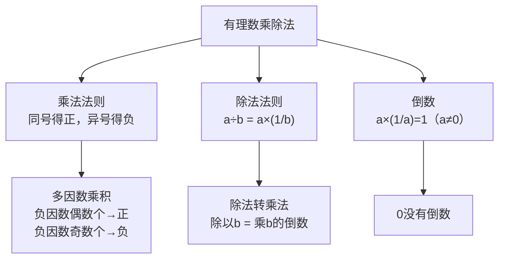

# 公式与法则卡片 · 有理数的乘除法

## 知识结构

## 1. 乘法符号法则

$$
(+) \times (+) = (+), \quad (-) \times (-) = (+)
$$

$$
(+) \times (-) = (-), \quad (-) \times (+) = (-)
$$

## 2. 与零相乘

$$
a \times 0 = 0
$$

## 3. 多因数乘积的符号

设 $n$ 为负因数个数（各因数均非零）：

$$
\text{积的符号} =
\begin{cases}
+, & n \text{ 为偶数} \\
-, & n \text{ 为奇数}
\end{cases}
$$

## 4. 倒数

$$
a \cdot \frac{1}{a} = 1 \quad (a \neq 0)
$$

## 5. 乘法运算律

$$
ab = ba
$$

$$
(ab)c = a(bc)
$$

$$
a(b + c) = ab + ac
$$

## 6. 除法法则

$$
a \div b = a \cdot \frac{1}{b} \quad (b \neq 0)
$$

$$
0 \div a = 0 \quad (a \neq 0)
$$

> ⚠️ $0$ 不能作除数。
