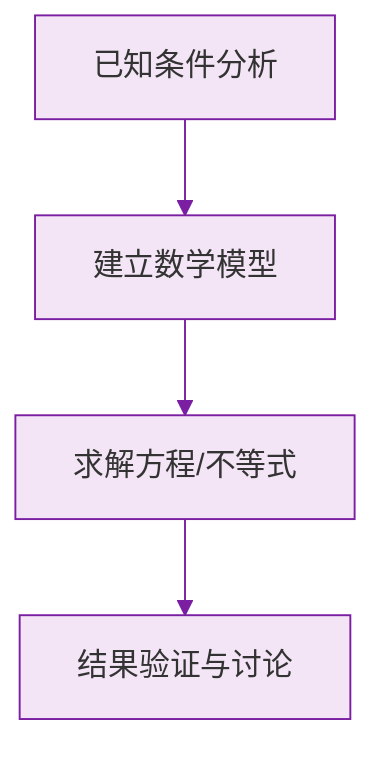

# 有理数的乘除法

标签：#中考必考 #基础 #需大量练习

## 一、有理数乘法法则

**两数相乘，同号得正，异号得负，并把绝对值相乘。**
任何数与 $0$ 相乘，都得 $0$。

例：

- $(-3) \times (-4) = +12$（同号得正）
- $(-3) \times 4 = -12$（异号得负）

**多个数相乘的符号规律**：

> 几个不为 $0$ 的数相乘，**负因数的个数为偶数时积为正，为奇数时积为负**；只要有一个因数为 $0$，积就是 $0$。

## 二、倒数

**乘积为 $1$ 的两个数互为倒数**：$a \cdot \frac{1}{a} = 1 \;(a \neq 0)$。

- $0$ **没有**倒数；
- 倒数等于它本身的数是 $1$ 和 $-1$；
- 负数的倒数还是负数。

> ⚠️ **易错点**：不要把「倒数」和「相反数」混淆——相反数看**和为 0**，倒数看**积为 1**。

## 三、乘法运算律

- **交换律**：$ab = ba$
- **结合律**：$(ab)c = a(bc)$
- **分配律**：$a(b + c) = ab + ac$

分配律的**逆用**（提公因数）是简便运算的大杀器，如：

$$
37.5 \times 101 - 37.5 = 37.5 \times (101 - 1) = 3750
$$

## 四、有理数除法法则

**法则一**：除以一个不等于 $0$ 的数，等于乘这个数的倒数：

$$a \div b = a \cdot \frac{1}{b} \;(b \neq 0)$$

**法则二**：两数相除，同号得正，异号得负，并把绝对值相除。
$0$ 除以任何非零的数都得 $0$；**$0$ 不能作除数**。

## 五、混合运算顺序

1. 先乘除，后加减；
2. 同级运算从左到右；
3. 有括号先算括号里（小 → 中 → 大）。

## 六、知识联系

- 前置：[[有理数的加减法]]（乘法本是加法的简便记法）；
- 后继：[[乘方|有理数乘方]]（乘法的进一步压缩）、分数运算贯穿整个初中代数。

### 数学几何与函数分析

<svg xmlns="http://www.w3.org/2000/svg" viewBox="0 0 300 200" style="background-color: #f3e5f5; border: 1px solid #7b1fa2; border-radius: 8px;">
  <line x1="20" y1="180" x2="280" y2="180" stroke="#7b1fa2" stroke-width="2" />
  <line x1="50" y1="20" x2="50" y2="180" stroke="#7b1fa2" stroke-width="2" />
  <path d="M50,180 Q150,20 280,180" fill="none" stroke="#9c27b0" stroke-width="3" />
  <text x="260" y="195" fill="#7b1fa2" font-size="12">X轴</text>
  <text x="10" y="30" fill="#7b1fa2" font-size="12">Y轴</text>
  <text x="140" y="100" fill="#7b1fa2" font-size="14">抛物线图示</text>
</svg>

