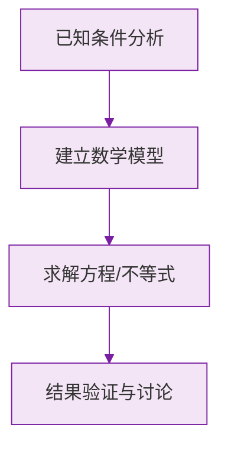

# 例题 · 乘方

## 例题 1（基础 · 概念与计算）

### 题目

计算：(1) $(-3)^3$；(2) $\left(-\frac{1}{2}\right)^4$；(3) $-2^4$；(4) $(-1)^{2025}$。

### 解析

(1) 负数的奇数次幂为负：$(-3)^3 = -27$；

(2) 负数的偶数次幂为正：$\left(-\frac{1}{2}\right)^4 = \frac{1}{16}$；

(3) 底数是 $2$，先乘方再取相反数：$-2^4 = -16$；

(4) $-1$ 的奇数次幂：$(-1)^{2025} = -1$。

> ⚠️ (3) 最容易错答 $16$——指数 4 只管 2，不管前面的负号。

---

## 例题 2（基础 · 辨析题）

### 题目

下列各组数中，结果相等的是（　　）

A. $(-2)^3$ 与 $-2^3$　　B. $(-2)^2$ 与 $-2^2$
C. $\left(\frac{2}{3}\right)^2$ 与 $\frac{2^2}{3}$　　D. $(-1)^2$ 与 $-1^2$

### 解析

- A：$(-2)^3 = -8$，$-2^3 = -8$，**相等** ✔；
- B：$(-2)^2 = 4$，$-2^2 = -4$，不等；
- C：$\left(\frac{2}{3}\right)^2 = \frac{4}{9}$，$\frac{2^2}{3} = \frac{4}{3}$，不等；
- D：$(-1)^2 = 1$，$-1^2 = -1$，不等。

**答案：A**

> 💡 当指数为**奇数**时，$(-a)^n$ 与 $-a^n$ 恰好相等；偶数时不等。

---

## 例题 3（中档 · 混合运算）

### 题目

计算：$-1^4 - (1 - 0.5) \times \frac{1}{3} \times \left[2 - (-3)^2\right]$。

### 解析

严格按"乘方 → 括号 → 乘除 → 加减"：

$$
\begin{aligned}
\text{原式} &= -1 - 0.5 \times \frac{1}{3} \times (2 - 9) \\
&= -1 - \frac{1}{2} \times \frac{1}{3} \times (-7) \\
&= -1 + \frac{7}{6} \\
&= \frac{1}{6}
\end{aligned}
$$

**答案：$\frac{1}{6}$**

> ⚠️ 开头的 $-1^4 = -1$（不是 $1$）；中括号里的 $(-3)^2 = 9$ 先算。

---

## 例题 4（提高 · 找规律）

### 题目

观察一列数：$-2,\ 4,\ -8,\ 16,\ -32,\ \dots$

(1) 写出第 $n$ 个数的表达式；
(2) 第 10 个数是多少？

### 解析

(1) 每个数的绝对值是 $2, 4, 8, 16, \dots = 2^n$；符号负、正交替，奇数项为负，可用 $(-1)^n$ 不对——第 1 项是负的，$(-1)^1 = -1$ ✔。所以第 $n$ 个数为：

$$
(-1)^n \cdot 2^n = (-2)^n
$$

(2) 第 10 个数：

$$
(-2)^{10} = 2^{10} = 1024
$$

**答案：(1) $(-2)^n$；(2) $1024$**

> 💡 正负交替的数列，用 $(-1)^n$ 或 $(-1)^{n+1}$ 控制符号是通用套路。

### 数学几何与函数分析

<svg xmlns="http://www.w3.org/2000/svg" viewBox="0 0 300 200" style="background-color: #f3e5f5; border: 1px solid #7b1fa2; border-radius: 8px;">
  <line x1="20" y1="180" x2="280" y2="180" stroke="#7b1fa2" stroke-width="2" />
  <line x1="50" y1="20" x2="50" y2="180" stroke="#7b1fa2" stroke-width="2" />
  <path d="M50,180 Q150,20 280,180" fill="none" stroke="#9c27b0" stroke-width="3" />
  <text x="260" y="195" fill="#7b1fa2" font-size="12">X轴</text>
  <text x="10" y="30" fill="#7b1fa2" font-size="12">Y轴</text>
  <text x="140" y="100" fill="#7b1fa2" font-size="14">抛物线图示</text>
</svg>

