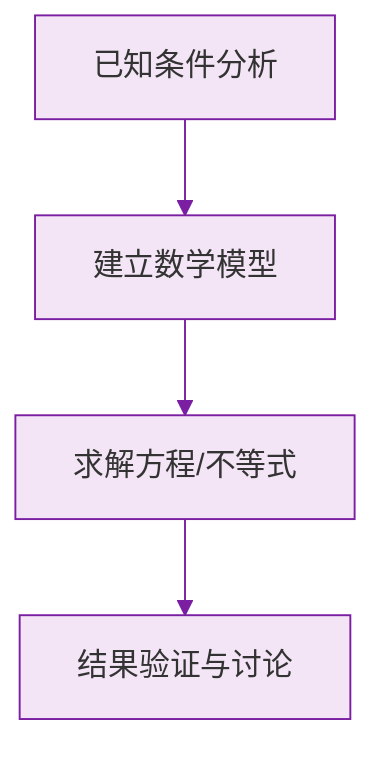

# 公式与定义卡片 · 乘方

## 1. 乘方的定义

$$
a^n = \underbrace{a \times a \times \cdots \times a}_{n \text{ 个 } a}
$$

$a$ 为底数，$n$ 为指数，结果称为幂。

## 2. 符号法则

$$
a > 0 \implies a^n > 0
$$

$$
a < 0 \implies
\begin{cases}
a^n > 0, & n \text{ 为偶数} \\
a^n < 0, & n \text{ 为奇数}
\end{cases}
$$

## 3. 特殊值

$$
0^n = 0 \ (n \text{ 为正整数}), \qquad 1^n = 1, \qquad (-1)^n = \begin{cases} 1, & n \text{ 偶} \\ -1, & n \text{ 奇} \end{cases}
$$

## 4. 易混对比

$$
(-a)^2 = a^2, \qquad -a^2 = -(a^2)
$$

$$
\left(\frac{a}{b}\right)^n = \frac{a^n}{b^n}
$$

## 5. 混合运算顺序

$$
\text{乘方} \to \text{乘除} \to \text{加减}, \quad \text{括号优先}
$$

### 数学几何与函数分析

<svg xmlns="http://www.w3.org/2000/svg" viewBox="0 0 300 200" style="background-color: #f3e5f5; border: 1px solid #7b1fa2; border-radius: 8px;">
  <line x1="20" y1="180" x2="280" y2="180" stroke="#7b1fa2" stroke-width="2" />
  <line x1="50" y1="20" x2="50" y2="180" stroke="#7b1fa2" stroke-width="2" />
  <path d="M50,180 Q150,20 280,180" fill="none" stroke="#9c27b0" stroke-width="3" />
  <text x="260" y="195" fill="#7b1fa2" font-size="12">X轴</text>
  <text x="10" y="30" fill="#7b1fa2" font-size="12">Y轴</text>
  <text x="140" y="100" fill="#7b1fa2" font-size="14">抛物线图示</text>
</svg>

