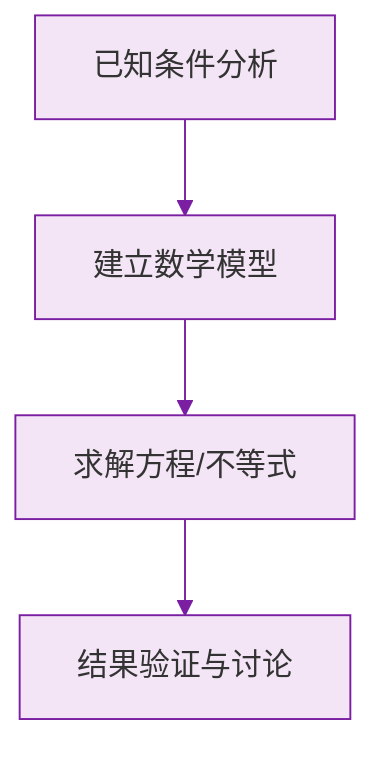

# 乘方

标签：#中考必考 #基础 #易错

## 一、乘方的定义

**求 $n$ 个相同因数的积的运算叫做乘方**，乘方的结果叫做**幂**。

$$
\underbrace{a \times a \times \cdots \times a}_{n \text{ 个}} = a^n
$$

在 $a^n$ 中：

| 名称 | 位置 | 含义 |
|---|---|---|
| **底数** $a$ | 下方 | 相同的因数 |
| **指数** $n$ | 右上角 | 因数的个数 |
| **幂** $a^n$ | 整体 | 乘方的结果 |

读法：$a^n$ 读作"$a$ 的 $n$ 次方"或"$a$ 的 $n$ 次幂"。

## 二、符号法则（重中之重）

1. **正数的任何次幂都是正数**；
2. **负数的奇数次幂是负数，偶数次幂是正数**；
3. $0$ 的任何正整数次幂都是 $0$；
4. $1$ 的任何次幂都是 $1$；$-1$ 的偶数次幂是 $1$，奇数次幂是 $-1$。

$$
(-2)^2 = 4, \qquad (-2)^3 = -8
$$

## 三、最大易错点：$(-a)^n$ 与 $-a^n$

$$
(-2)^2 = (-2)\times(-2) = 4, \qquad -2^2 = -(2 \times 2) = -4
$$

- $(-2)^2$：底数是 $-2$，括号内整体乘方；
- $-2^2$：底数是 $2$，先乘方再取相反数——**指数只管紧挨它的数**。

同样地，$\left(\frac{2}{3}\right)^2 = \frac{4}{9}$，而 $\frac{2}{3^2} = \frac{2}{9}$；分数乘方必须加括号。

> ⚠️ **易错点**：$-2^2 = -4$ 而不是 $4$，这是初一考试中"送分变丢分"第一名。

## 四、有理数的混合运算顺序

引入乘方后，运算顺序更新为：

1. **先乘方**；
2. 再乘除；
3. 最后加减；
4. 有括号先算括号内（小 → 中 → 大）。

例：

$$
2 + (-3)^2 \times \frac{1}{3} = 2 + 9 \times \frac{1}{3} = 2 + 3 = 5
$$

## 五、要点小结

1. 乘方是"相同因数连乘"的简写；
2. 负数的幂：看指数奇偶定符号；
3. $-a^n$ 与 $(-a)^n$ 意义不同；
4. 混合运算"乘方 → 乘除 → 加减"。

## 六、知识联系

- 乘方建立在[[有理数的乘除法]]之上；
- [[科学记数法]]要用 $10$ 的乘方表示大数；
- 初二的幂运算（同底数幂相乘等）以本节为地基。

### 数学几何与函数分析

<svg xmlns="http://www.w3.org/2000/svg" viewBox="0 0 300 200" style="background-color: #f3e5f5; border: 1px solid #7b1fa2; border-radius: 8px;">
  <line x1="20" y1="180" x2="280" y2="180" stroke="#7b1fa2" stroke-width="2" />
  <line x1="50" y1="20" x2="50" y2="180" stroke="#7b1fa2" stroke-width="2" />
  <path d="M50,180 Q150,20 280,180" fill="none" stroke="#9c27b0" stroke-width="3" />
  <text x="260" y="195" fill="#7b1fa2" font-size="12">X轴</text>
  <text x="10" y="30" fill="#7b1fa2" font-size="12">Y轴</text>
  <text x="140" y="100" fill="#7b1fa2" font-size="14">抛物线图示</text>
</svg>

