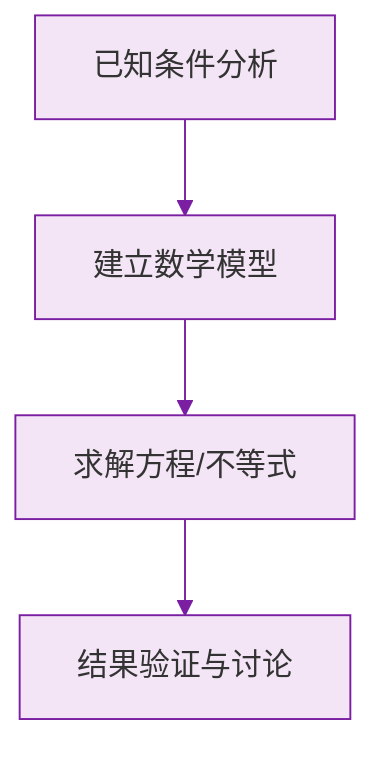

# 例题 · 科学记数法

## 例题 1（基础 · 正向表示）

### 题目

用科学记数法表示下列各数：(1) $69300$；(2) $-8040000$；(3) $10000000$。

### 解析

(1) 整数位数 5 位，$n = 4$：

$$
69300 = 6.93 \times 10^4
$$

(2) 负号照抄，整数位数 7 位，$n = 6$：

$$
-8040000 = -8.04 \times 10^6
$$

(3) 整数位数 8 位，$n = 7$：

$$
10000000 = 1 \times 10^7
$$

> 💡 (3) 中 $a = 1$ 时不能省略，完整写成 $1 \times 10^7$。

---

## 例题 2（基础 · 带单位换算）

### 题目

2024 年某市常住人口约 2185 万人，用科学记数法表示这个数。

### 解析

先换算单位：

$$
2185 \text{ 万} = 21850000
$$

整数位数 8 位，$n = 7$：

$$
21850000 = 2.185 \times 10^7
$$

**答案：$2.185 \times 10^7$ 人**

> ⚠️ "万""亿"必须先化成完整的数（或直接用 $10^4$、$10^8$ 换算），最容易错成 $2.185 \times 10^3$。

---

## 例题 3（基础 · 还原与判断）

### 题目

(1) 把 $3.05 \times 10^5$ 还原成原数；
(2) 判断 $25 \times 10^3$ 和 $0.9 \times 10^6$ 是不是规范的科学记数法，若不是请改正。

### 解析

(1) 小数点右移 5 位：

$$
3.05 \times 10^5 = 305000
$$

(2) 都不规范：

- $25 \times 10^3$：$a = 25 \ge 10$，应改为 $2.5 \times 10^4$；
- $0.9 \times 10^6$：$a = 0.9 < 1$，应改为 $9 \times 10^5$。

> 💡 检验口诀：**$a$ 的整数部分只能有一位，且不为 0。**

---

## 例题 4（中档 · 比较大小与运算）

### 题目

(1) 比较 $3.2 \times 10^6$ 与 $9.9 \times 10^5$ 的大小；
(2) 计算 $(3 \times 10^4) \times (2 \times 10^3)$，结果用科学记数法表示。

### 解析

(1) 先比指数：$10^6 > 10^5$，指数大的数大：

$$
3.2 \times 10^6 > 9.9 \times 10^5
$$

(2) 系数与系数相乘，$10$ 的幂相加（$10^4 \times 10^3 = 10^7$）：

$$
(3 \times 2) \times 10^{7} = 6 \times 10^7
$$

**答案：(1) $3.2 \times 10^6$ 更大；(2) $6 \times 10^7$**

> 💡 比较科学记数法先看指数，指数相同再比 $a$。

### 数学几何与函数分析

<svg xmlns="http://www.w3.org/2000/svg" viewBox="0 0 300 200" style="background-color: #f3e5f5; border: 1px solid #7b1fa2; border-radius: 8px;">
  <line x1="20" y1="180" x2="280" y2="180" stroke="#7b1fa2" stroke-width="2" />
  <line x1="50" y1="20" x2="50" y2="180" stroke="#7b1fa2" stroke-width="2" />
  <path d="M50,180 Q150,20 280,180" fill="none" stroke="#9c27b0" stroke-width="3" />
  <text x="260" y="195" fill="#7b1fa2" font-size="12">X轴</text>
  <text x="10" y="30" fill="#7b1fa2" font-size="12">Y轴</text>
  <text x="140" y="100" fill="#7b1fa2" font-size="14">抛物线图示</text>
</svg>

