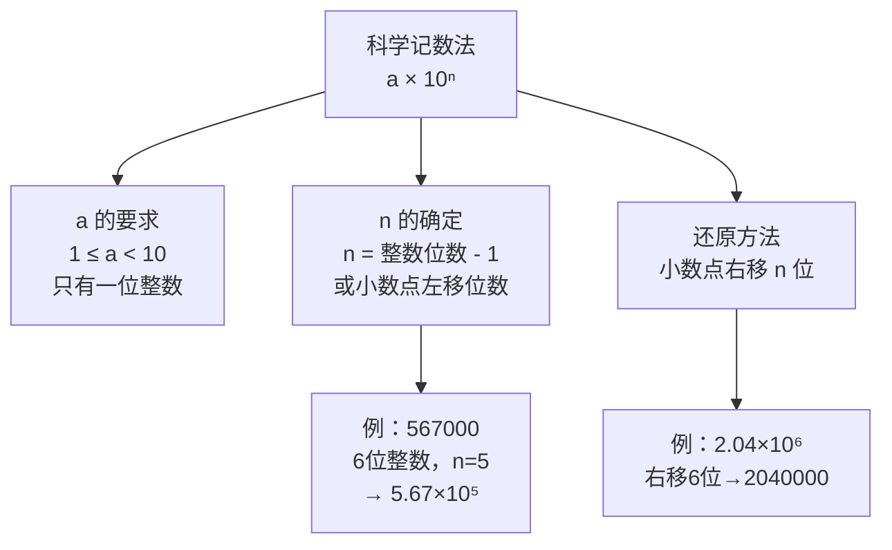

# 公式与定义卡片 · 科学记数法

## 知识结构

## 1. 标准形式

$$
N = a \times 10^n, \qquad 1 \le a < 10,\ n \in \mathbb{Z}^{+}
$$

## 2. 指数的确定

$$
n = (\text{原数的整数位数}) - 1
$$

或：小数点左移的位数。

## 3. 还原

$$
a \times 10^n \longrightarrow \text{把 } a \text{ 的小数点右移 } n \text{ 位}
$$

## 4. 常用数量级参照

$$
1 \text{ 万} = 10^4, \qquad 1 \text{ 亿} = 10^8
$$

$$
36 \text{ 万} = 3.6 \times 10^5, \qquad 2.5 \text{ 亿} = 2.5 \times 10^8
$$
