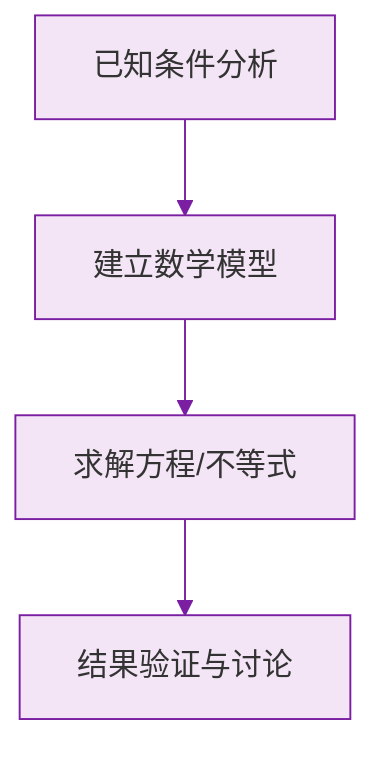

# 公式与定义卡片 · 科学记数法

## 1. 标准形式

$$
N = a \times 10^n, \qquad 1 \le a < 10,\ n \in \mathbb{Z}^{+}
$$

## 2. 指数的确定

$$
n = (\text{原数的整数位数}) - 1
$$

或：小数点左移的位数。

## 3. 还原

$$
a \times 10^n \longrightarrow \text{把 } a \text{ 的小数点右移 } n \text{ 位}
$$

## 4. 常用数量级参照

$$
1 \text{ 万} = 10^4, \qquad 1 \text{ 亿} = 10^8
$$

$$
36 \text{ 万} = 3.6 \times 10^5, \qquad 2.5 \text{ 亿} = 2.5 \times 10^8
$$

### 数学几何与函数分析

<svg xmlns="http://www.w3.org/2000/svg" viewBox="0 0 300 200" style="background-color: #f3e5f5; border: 1px solid #7b1fa2; border-radius: 8px;">
  <line x1="20" y1="180" x2="280" y2="180" stroke="#7b1fa2" stroke-width="2" />
  <line x1="50" y1="20" x2="50" y2="180" stroke="#7b1fa2" stroke-width="2" />
  <path d="M50,180 Q150,20 280,180" fill="none" stroke="#9c27b0" stroke-width="3" />
  <text x="260" y="195" fill="#7b1fa2" font-size="12">X轴</text>
  <text x="10" y="30" fill="#7b1fa2" font-size="12">Y轴</text>
  <text x="140" y="100" fill="#7b1fa2" font-size="14">抛物线图示</text>
</svg>

