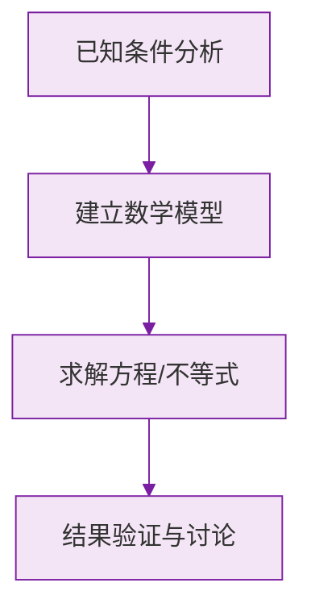

# 科学记数法

标签：#中考必考 #基础

## 一、为什么需要科学记数法

太阳与地球的距离约 $150000000$ 千米，光速约 $300000000$ 米/秒——这么多 0，又难读又易错。数学家发明了一种"压缩包"写法：

$$
150000000 = 1.5 \times 10^8
$$

## 二、科学记数法的定义

把一个大于 10 的数记成

$$
a \times 10^n
$$

的形式，其中 **$1 \le a < 10$**，$n$ 为正整数，这种记数方法叫做**科学记数法**。

两个部件的要求：

| 部件 | 要求 | 示例 |
|---|---|---|
| $a$ | $1 \le a < 10$，只留一位整数 | $1.5$、$9.99$ ✔；$15$、$0.8$ ✘ |
| $n$ | 正整数 | 等于原数的**整数位数减 1** |

## 三、如何确定指数 $n$

**方法 1（数位法）**：$n = $ 原数的整数位数 $- 1$。

例：$567000$ 有 6 位整数，$n = 5$，即 $5.67 \times 10^5$。

**方法 2（移动小数点法）**：小数点向左移动了几位，$n$ 就是几。

例：$567000 \to 5.67$，小数点左移 5 位，$n = 5$。

> ⚠️ **易错点**：
> 1. $a$ 忘记满足 $1 \le a < 10$：$34 \times 10^4$ 是错误写法，应为 $3.4 \times 10^5$；
> 2. 带单位的数要先换算：$36$ 万 $= 360000 = 3.6 \times 10^5$。

## 四、还原：从科学记数法写回原数

$a \times 10^n$ 还原时，把 $a$ 的小数点**向右移动 $n$ 位**，位数不够补 0。

例：$2.04 \times 10^6 = 2040000$。

## 五、要点小结

1. 形式：$a \times 10^n$，$1 \le a < 10$；
2. $n$ = 整数位数 $- 1$；
3. 还原时小数点右移 $n$ 位；
4. 负数同理，符号照抄：$-23000 = -2.3 \times 10^4$。

## 六、知识联系

- 科学记数法是[[乘方]]（$10$ 的幂）的直接应用；
- 与[[近似数]]常结合出题："用科学记数法表示并保留两位有效数字"；
- 初二学负整数指数幂后，还能表示 $0.00001$ 这类小数。

### 数学几何与函数分析

<svg xmlns="http://www.w3.org/2000/svg" viewBox="0 0 300 200" style="background-color: #f3e5f5; border: 1px solid #7b1fa2; border-radius: 8px;">
  <line x1="20" y1="180" x2="280" y2="180" stroke="#7b1fa2" stroke-width="2" />
  <line x1="50" y1="20" x2="50" y2="180" stroke="#7b1fa2" stroke-width="2" />
  <path d="M50,180 Q150,20 280,180" fill="none" stroke="#9c27b0" stroke-width="3" />
  <text x="260" y="195" fill="#7b1fa2" font-size="12">X轴</text>
  <text x="10" y="30" fill="#7b1fa2" font-size="12">Y轴</text>
  <text x="140" y="100" fill="#7b1fa2" font-size="14">抛物线图示</text>
</svg>

