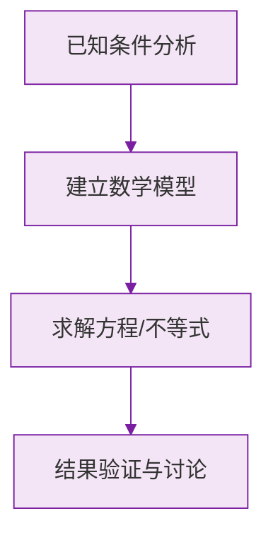

# 例题 · 近似数

## 例题 1（基础 · 四舍五入）

### 题目

用四舍五入法，按要求取 $3.14159$ 的近似数：

(1) 精确到 $0.01$；(2) 精确到千分位；(3) 精确到个位。

### 解析

(1) 百分位是 4，看下一位 1（$<5$ 舍去）：$3.14$；

(2) 千分位是 1，看下一位 5（$\ge 5$ 进一）：$3.142$；

(3) 个位是 3，看下一位 1（舍去）：$3$。

**答案：(1) $3.14$；(2) $3.142$；(3) $3$**

---

## 例题 2（基础 · 判断精确度）

### 题目

下列各近似数分别精确到哪一位？

(1) $0.030$；(2) $1.2$ 万；(3) $4.50 \times 10^3$。

### 解析

(1) 最后一位 0 在**千分位**——精确到千分位（0.001）；

(2) $1.2$ 万 $= 12000$，最后一位数字 2 在**千位**——精确到千位；

(3) $4.50 \times 10^3 = 4500$，最后一位数字 0 在**十位**——精确到十位。

> ⚠️ (1) 中末尾的 0 是有效信息，说明精确到千分位，不能当作 $0.03$ 看待。

---

## 例题 3（中档 · 综合应用）

### 题目

我国某年粮食产量约为 686530000 吨。

(1) 用科学记数法表示这个数；
(2) 用四舍五入法精确到千万位，并用科学记数法表示结果。

### 解析

(1) 整数位数 9 位，$n = 8$：

$$
686530000 = 6.8653 \times 10^8
$$

(2) 千万位是 8，看下一位 6（进一）：

$$
686530000 \approx 690000000 = 6.9 \times 10^8
$$

**答案：(1) $6.8653 \times 10^8$ 吨；(2) $6.9 \times 10^8$ 吨**

> 💡 "先取近似，再科学记数"两步分开做，不要跳步。

---

## 例题 4（提高 · 反推原数范围）

### 题目

一个数四舍五入后的近似数是 $8.0$，那么这个数的最大值可能超过 $8.04$ 吗？最小可能是多少？

### 解析

近似数 $8.0$ 精确到十分位（$u = 0.1$），设原数为 $x$：

$$
7.95 \le x < 8.05
$$

- 最大值可以非常接近 $8.05$（但取不到），所以**可以超过 $8.04$**，例如 $8.049$；
- 最小值是 $7.95$。

**答案：可以超过 $8.04$（上界为 $8.05$，取不到）；最小是 $7.95$**

> ⚠️ 反推范围时区间是"左闭右开"：$7.95$ 会进位成 $8.0$ ✔，而 $8.05$ 会进位成 $8.1$ ✘。

### 数学几何与函数分析

<svg xmlns="http://www.w3.org/2000/svg" viewBox="0 0 300 200" style="background-color: #f3e5f5; border: 1px solid #7b1fa2; border-radius: 8px;">
  <line x1="20" y1="180" x2="280" y2="180" stroke="#7b1fa2" stroke-width="2" />
  <line x1="50" y1="20" x2="50" y2="180" stroke="#7b1fa2" stroke-width="2" />
  <path d="M50,180 Q150,20 280,180" fill="none" stroke="#9c27b0" stroke-width="3" />
  <text x="260" y="195" fill="#7b1fa2" font-size="12">X轴</text>
  <text x="10" y="30" fill="#7b1fa2" font-size="12">Y轴</text>
  <text x="140" y="100" fill="#7b1fa2" font-size="14">抛物线图示</text>
</svg>

