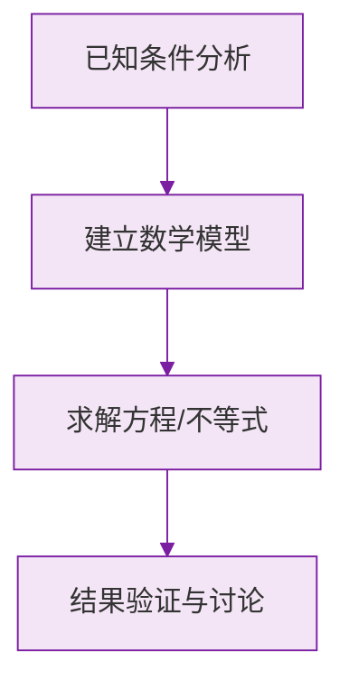

# 公式与定义卡片 · 近似数

## 1. 四舍五入规则

看保留位的**下一位数字** $d$：

$$
d \ge 5 \implies \text{进一}, \qquad d < 5 \implies \text{舍去}
$$

## 2. 精确度的判断

$$
\text{精确度} = \text{近似数最后一位数字所在的数位}
$$

例如 $2.40$ 精确到百分位；$3.6 \times 10^4 = 36000$ 精确到千位。

## 3. 近似数的原数范围

若 $x$ 四舍五入到某位得近似数 $a$，设该位的一个单位为 $u$，则：

$$
a - \frac{u}{2} \le x < a + \frac{u}{2}
$$

例：$a = 2.5$（$u = 0.1$）时，$2.45 \le x < 2.55$。

### 数学几何与函数分析

<svg xmlns="http://www.w3.org/2000/svg" viewBox="0 0 300 200" style="background-color: #f3e5f5; border: 1px solid #7b1fa2; border-radius: 8px;">
  <line x1="20" y1="180" x2="280" y2="180" stroke="#7b1fa2" stroke-width="2" />
  <line x1="50" y1="20" x2="50" y2="180" stroke="#7b1fa2" stroke-width="2" />
  <path d="M50,180 Q150,20 280,180" fill="none" stroke="#9c27b0" stroke-width="3" />
  <text x="260" y="195" fill="#7b1fa2" font-size="12">X轴</text>
  <text x="10" y="30" fill="#7b1fa2" font-size="12">Y轴</text>
  <text x="140" y="100" fill="#7b1fa2" font-size="14">抛物线图示</text>
</svg>

